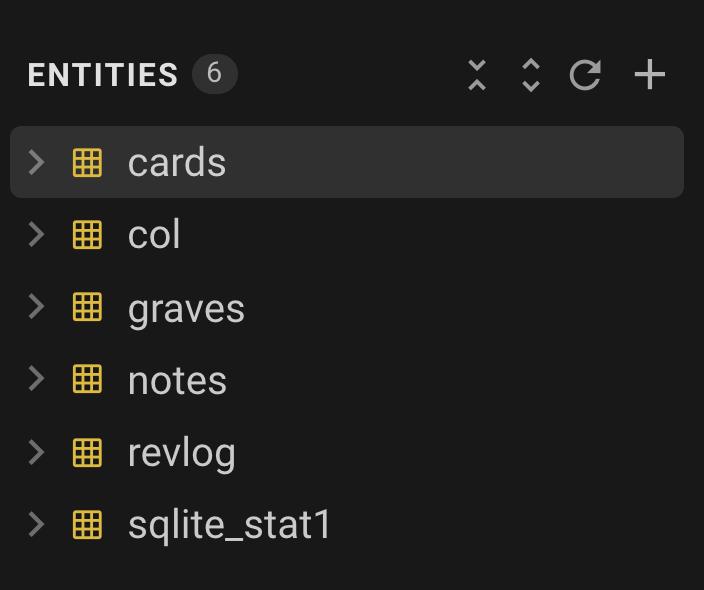
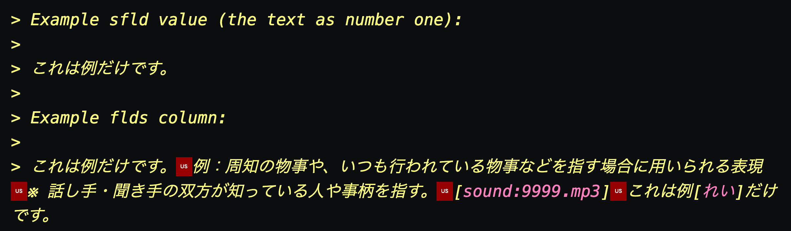
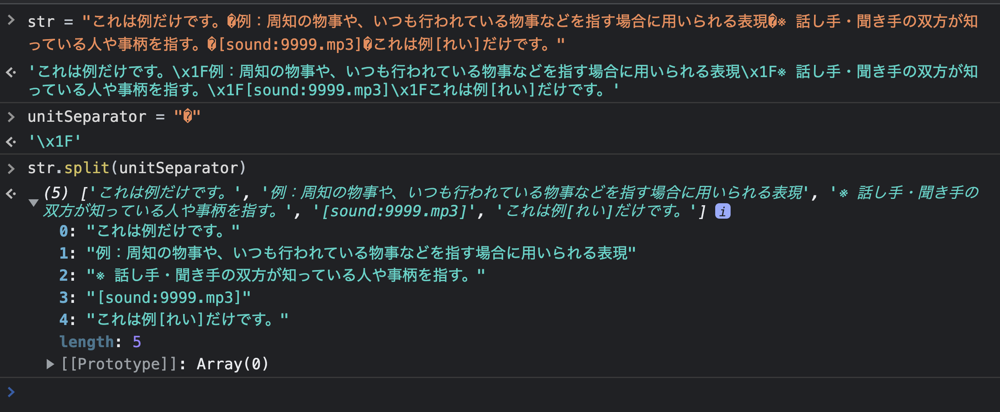
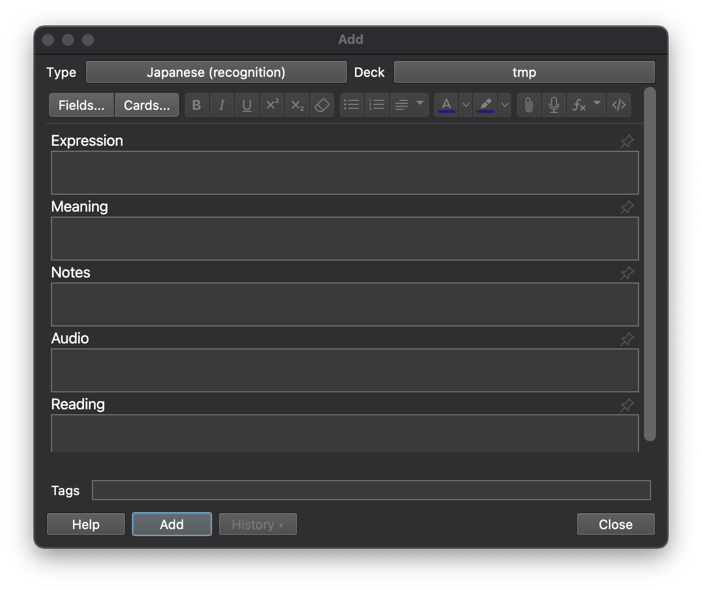
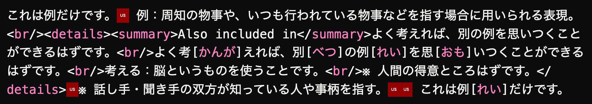
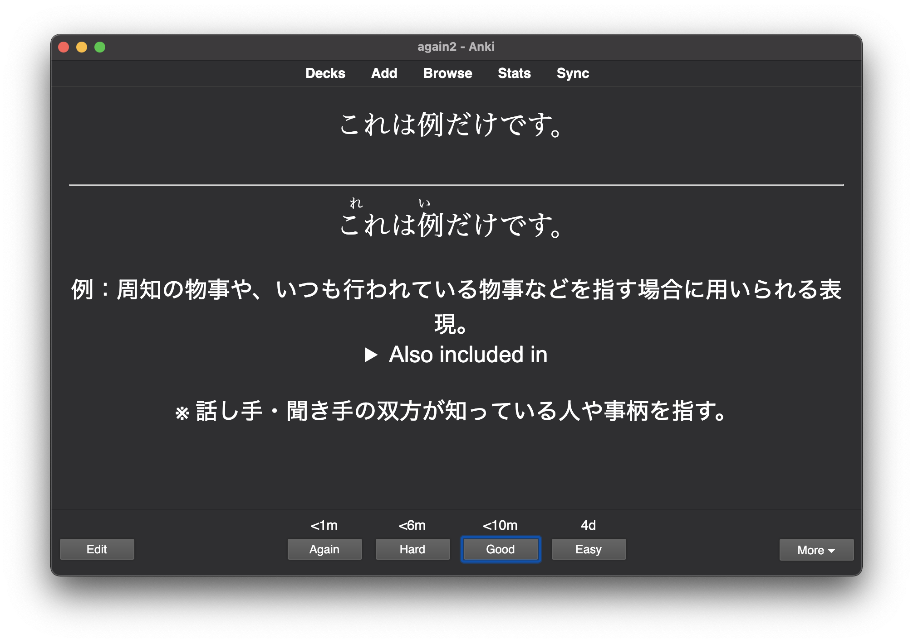
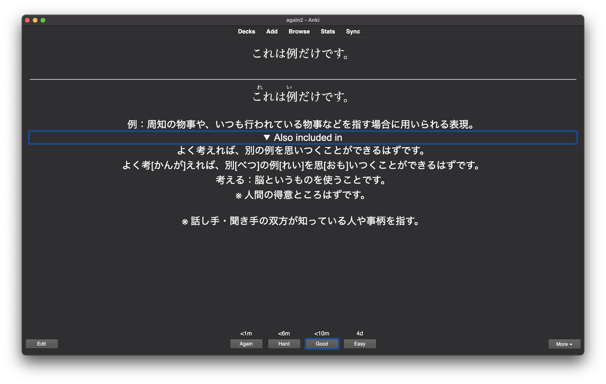

---
dateCreated:
title: Jalup end of life
toc: true
---

## Intro

[Jalup](https://japaneselevelup.com/) - a Japanese language learning app - has recently been [officially "ended"](https://japaneselevelup.com/the-end-of-jalup/). Not sure on the terminology. It might be the case that the app is still available for sale but discouraged (or maybe just the Anki decks are - I had read about this somewhere but forgot now). Anyway, the biggest concern for existing customers - myself included - is that there will be no more updates to the app; meaning it's only a matter of time for the app to break if you keep your phone updated.

Anki decks covering the same content in the app should have been made available - having purchased the full content via a bulk purchase with a number of other people - I already had these (i.e. get in contact with the owner of Jalup for more info on this if you need them / try the community discord server).

The problem with the Anki approach is that it lacks some features of the app - namely - the linking of related cards. Personally, I always found Anki to be a bit complicated to use and never quite stuck to it long enough.

I have started examining what options are available given the content I have access to through my purchase.

## What do I have access to?

Apart from a bunch of other files - it looks like the most relevant data files I have access to are `.xlsx` and `.apkg` files for different "stages" in the different Jalup levels, e.g.

- Jalup Intermediate Package
  - Jalup Intermediate Stage 1
    - Jalup Intermediate - Stage 1.apkg
    - Jalup Intermediate Stage 1.xlsx
  - … Stage 2 - 4
- … other levels

`.xlsx` files are the Microsoft Excel files with textual only data. They are easier to read data from when compared with the `.apkg` files, but they lack media files i.e. the audio.

`.apkg` files can be used to load content into Anki. It seems to be a zip file with serveral files using numbers for names (the media), a file actually named `media` that is a JSON file with key / value pairs like so:

```json
{
  "216": "1046.mp3",
  "217": "1173.mp3"
  // "etc": "..."
}
```

… and finally and most importantly, an SQLite database in a file named `collection.anki2`.

The contents of the db are not clear to me at this stage but I did find some resources:

- [Processing Anki's .apkg files](https://github.com/SergioFacchini/anki-cards-web-browser/blob/master/documentation/Processing%20Anki's%20.apkg%20files.md)
- [Database Structure](https://github.com/ankidroid/Anki-Android/wiki/Database-Structure)

It seems inevitable that any interesting use of the content I have available will involve accessing the data in the `.apkg` file, primarily it's db.

If you extract an `.apkg` file and open the `collection.anki2` with something like [Beekeeper Studio](https://www.beekeeperstudio.io/) (selecting a connection type of "SQLite" and a the `collection.anki2` as the "Database File"), you'd see the included "Entities" as shown in the screenshot below:



Right clicking -> "View Data" (or otherwise viewing the data e.g. selecting it), will show you the contents of the table. Doing so on the `notes` table should gives all the relevant data to work with (to start thinking about how notes can be linked anyway).

### sfld column

The `sfld` column seems to be the note's question - at least - it's the question part in the Jalup app. No idea how `sfld`'s type is `integer` though. That's what the column type shows in the GUI client, and even inspecting the table's meta data says so:

```sql
SELECT `sql`
  FROM `sqlite_master`
  WHERE type='table' AND name='notes';

-- Result:
CREATE TABLE notes (
    id              integer primary key,   /* 0 */
    guid            text not null,         /* 1 */
    mid             integer not null,      /* 2 */
    mod             integer not null,      /* 3 */
    usn             integer not null,      /* 4 */
    tags            text not null,         /* 5 */
    flds            text not null,         /* 6 */
    sfld            integer not null,      /* 7 */
    csum            integer not null,      /* 8 */
    flags           integer not null,      /* 9 */
    data            text not null          /* 10 */
)
```

The [Anki-Android's Database structure](https://github.com/ankidroid/Anki-Android/wiki/Database-Structure#notes) wiki has this to say about it:

```sql
sfld            integer not null,
-- sort field: used for quick sorting and duplicate check.
-- The sort field is an integer so that when users are sorting on a field that contains only numbers, they are sorted in numeric instead of lexical order.
-- Text is stored in this integer field.
```

> Text is stored in this integer field.

🤔 ok… so I guess a certain amount of text fits in `sfld` and the text's numerical value is used for sorting - 🤷 whatever.

### flds column

The `flds` column seems to have all the question + answer + extra info part of the note. Again, [Anki-Android's Database structure](https://github.com/ankidroid/Anki-Android/wiki/Database-Structure#notes) doc is useful here:

```sql
flds            text not null,
-- the values of the fields in this note. separated by 0x1f (31) character.
```

… especially the:

> separated by 0x1f (31) character.

… part. Just for kicks, inputting that character [here](https://www.babelstone.co.uk/Unicode/whatisit.html) gives:

> U+001F : <control> INFORMATION SEPARATOR ONE {unit separator (US)}

Some more info on [SO](https://stackoverflow.com/questions/6693153/what-is-character-0x1f).

Whatever, point is, if you use that character in e.g. Javascript's String's [split](https://developer.mozilla.org/en-US/docs/Web/JavaScript/Reference/Global_Objects/String/split) method, it works and we're able to get to the individual parts of the full string, of which there seems to be 5. Any missing parts will just be 2 (or maybe more - I've only come across 2) consecutive unit separator characters.

1. 1st entry is the question (it's exactly the same as the `sfld` value).
1. 2nd entry is the answer. As far as I can tell and remember, these always start with `X：` where `X` is the new vocab to learn. I've only been through Jalup intermediate and kanji kingdom (and not all - not by a long shot. I can only tell based on those though).
1. 3rd entry seems to be "extra info". This is the entry I found in some rows and not in others. They seem to always start with: `※ `.
1. 4th entry is the sound file.
1. 5th entry is the question again but this time with hiragana for the kanji (the furigana).

I can't exactly show examples here as this is paid content and - even if it's just one - I'd rather not take something someone clearly doesn't want in the public and share it. But here's an example which was **not** taken from the Jalup app:

> Example sfld value (the text as number one):
>
> これは例だけです。
>
> Example flds column:
>
> これは例だけです。 例：周知の物事や、いつも行われている物事などを指す場合に用いられる表現 ※ 話し手・聞き手の双方が知っている人や事柄を指す。[sound:9999.mp3] これは例[れい]だけです。

The US (unit separator) character isn't visible in the quote above, so here's a screenshot of how the text editor I'm using [VS Code](https://code.visualstudio.com/) displays this:



The flds parts:

<!--
Use 1. throught the numbered bullets so the parent level keeps it's counter without continuing from sub list.
e.g. if you use "-" for the innter list instead of "1.", then the 3rd list item (after the sub list) will be "14.".

However, to actually get "-" in the HTML for the sublist, overwrite it's content in the following style tag.
-->
<style>
style+ol ol li::before {
    content: '- '
}
</style>

1. 1st part is the question: 「これは例だけです。」"This is just an example".
1. 2nd part is the answer with the Japanese explanation of the new Japanese term. I used [weblio.jp](https://www.weblio.jp/content/%E4%BE%8B%E3%81%AE) to explain 「例」 in Japanese. In case you're unfamiliar with Jalup - this is it's main philosophy / differentiator. After a certain point, it's learning Japanese in Japanese by building on material you've already covered.

   1. 周知の物事: しゅうちのものごと：well known things / things of common knowledge.
   1. や: particle - "such things as... / and...".
   1. いつも行われている物事: いつもおこなわれているものごと：Things that are always done. 行われる: to be done.
   1. など：etc…
   1. を: particle - direct object marker.
   1. 指す場合に用いられる: さすばあいにもちいられる: Used when pointing. Literally: "to point case when for purpose use"
   1. 表現: ひょうげん: expression
   1. [Google translate](https://translate.google.com/?sl=ja&tl=en&text=%E5%91%A8%E7%9F%A5%E3%81%AE%E7%89%A9%E4%BA%8B%E3%82%84%E3%80%81%E3%81%84%E3%81%A4%E3%82%82%E8%A1%8C%E3%82%8F%E3%82%8C%E3%81%A6%E3%81%84%E3%82%8B%E7%89%A9%E4%BA%8B%E3%81%AA%E3%81%A9%E3%82%92%E6%8C%87%E3%81%99%E5%A0%B4%E5%90%88%E3%81%AB%E7%94%A8%E3%81%84%E3%82%89%E3%82%8C%E3%82%8B%E8%A1%A8%E7%8F%BE&op=translate): Expressions used to refer to well-known things or things that are always done.
   1. Ok maybe all this was not necessary…
   1. I'm gonna stop now… so addictive…
   1. bullets!

1. 3rd part is another take on the answer - again using [weblio.jp](https://www.weblio.jp/content/%E4%BE%8B%E3%81%AE). These appear in some items in the Jalup app to provide further explanation or just another take on the Japanese explanation (also in Japanese of course 🙂).
1. 4th part - sound file.
1. 5th part - question with furigana.

So basically, getting access to each part is a simple matter in a general purpose programming language (e.g. in Javascript browser console below):



I'm sure this can be done in SQL directly but I'd need to "Git Gud" at SQL first… Leaving a note of a failed attempt just in case I / someone can use it at some point (from this [SO question](https://stackoverflow.com/questions/24258878/how-to-split-comma-separated-value-in-sqlite)):

```sql
# https://stackoverflow.com/questions/24258878/how-to-split-comma-separated-value-in-sqlite
WITH split(sentence, str) AS (
    SELECT '', flds||'' from notes
    UNION all SELECT
    substr(str, 0, instr(str, '')),
    substr(str, instr(str, '')+1)
    FROM split WHERE str!=''
) SELECT sentence FROM split WHERE sentence!='';
```


## Doing something possibly useful

Ok so now what? A number of possibilities come to mind - but the easiest to implement right now for a quick win would be to do something along the lines of the following which I'll call `algorithm-1` in case I need to reference it later:

1. Select all the notes: `select * from notes;`. For each note `n`:

   1. Set `fields` as `n.flds`.
   1. Set `itemToLearn` as `fields.split('US')[1].split('：')[0]` - where `'US'` is the unit separator character (using above e.g. value for `itemToLearn` would be `例`).
   1. Set `alsoIncludedIn` to the array of values from selecting all other notes which contain the `itemToLearn` in their `sfld` (the one with just the question):
      1. `connection.query("select * from notes where sfld like '%?%' and id != ?", [itemToLearn, n.id])`;
      1. Use a means to avoid SQL injection like the placeholders above even though we are not accepting user input (in case of future changes). Assumes `connection.query` sanitizes any inputs we pass in for the placeholders.
   1. If `alsoIncludedIn` is not empty, use a template to augment something in `n.flds`. E.g. we could pick `n.flds[1]` - the second part (the answer). We could add this at the end of `n.flds[1]`: `<br/><details><summary>Also included in</summary>${pseudoLinkedItems}</details>` - where `pseudoLinkedItems` can be the concatenation of the following for each item in `alsoIncludedIn[i].flds` (maybe limited to some number via an argument to the program to prevent the added content from being too long):

   ```js
   function toStringToAugmentOriginalNoteWith(alsoIncludedIn) {
     let pseudoLinkedItems = '';
     for (let i = 0; i < alsoIncludedIn.length; i++) {
       const otherFields = alsoIncludedIn[i].flds;
       // question + sound file + <br/> + furigana + <br/> answer + <br/> + additional notes  + <br/>
       pseudoLinkedItems += `${otherFields[0]}${otherFields[3]}<br/>${otherFields[4]}<br/>${otherFields[1]}<br/>${otherFields[2]}<br/>`;
     }
     return pseudoLinkedItems;
   }
   ```

At this point, it would be nice to show how this would look like in Anki. But first, lets go over what a Jalup Anki setup gives us. Had to familiarise myself with this as well as only a basic Anki user myself. After importing one of the stages (namely "Jalup Intermediate - Stage 1") in Anki, and creating a new deck, if I go to "Add" a card to the deck, I see I have the type `Japanese (recognition)` I can select:



These are pretty familiar - they're the fields we've already seen in the db. The "Cards…" button (top left next to "Fields…") is pretty interesting as it's where the front / back template of the card is - and you can get an idea of how the different fields are placed within each (front / back) template.

But anyway, good to know if you didn't before (I didn't). What I would like to do is create an apkg file with that one `例` example from before, using the Jalup `Japanese (recognition)` template (wonder if there are other templates - name seems to suggest there are). That way, I can avoid any concerns with sharing paid for content and get something to work with. You can do it yourself or download the one I named `tmp.apkg` from [here](res/tmp.apkg) (note: no audio).

Now, if I extract `tmp.apkg`; connect to `collection.anki2` using something like [Beekeeper Studio](https://www.beekeeperstudio.io/); and double click on the `notes` table to view it's content; I can manually make the edits described in the [algorithm-1](#doing-something-possibly-useful) above (via copy / pasting into the `flds` column and saving back to the `collection.anki2` file (simply save (ctrl+s / cmd+s) the open tab in Beekeeper Studio). Of course, since there's only one note, there won't be any `alsoIncludedIn` matches to augment the note with - but I'll add some dummy content just to illustrate. The altered note should look like this:



<!--
これは例だけです。 例：周知の物事や、いつも行われている物事などを指す場合に用いられる表現。<br/><details><summary>Also included in</summary>よく考えれば、別の例を思いつくことができるはずです。<br/>よく考[かんが]えれば、別[べつ]の例[れい]を思[おも]いつくことができるはずです。<br/>考える：脳というものを使うことです。<br/>※ 人間の得意ところはずです。</details>※ 話し手・聞き手の双方が知っている人や事柄を指す。 これは例[れい]だけです。

よく考えれば、別の例を思いつくことができるはずです。 考える：脳というものを使うことです。※ 人間の得意ところはずです。よく考[かんが]えれば、別[べつ]の例[れい]を思[おも]いつくことができるはずです。
-->

After making the manual edits, I can re-create the apkg file by zipping the directory contianing `collection.anki2`:

```sh
zip -j -r ./alt-tmp.apkg ./tmp
```

You can download `alt-tmp.apkg` from [here](res/alt-tmp.apkg). If you have `tmp.apkg` imported in Anki, first delete it and then import `alt-tmp.apkg` and you should see the result:



And expanded:



I'm not sure why the `れい` furigana isn't aligned with the kanji, but close enough.
