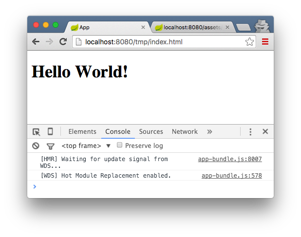

## Intro

This post demos an example of using [Webpack](https://webpack.github.io/) to bundle a frontend project and [Maven](https://maven.apache.org/) to package it up in a [jar](https://docs.oracle.com/javase/tutorial/deployment/jar/index.html) and include it in a [Spring Boot](http://projects.spring.io/spring-boot/) app to serve it.

The example in its final state is up on [Github](https://github.com/justin-calleja/webpack-mvn).

## Getting started

We'll start by creating the 3 following projects:

- parent
- fe
- be

`parent` is just a convenient way to package both our other 2 modules up in one go. It only consists of the following `pom.xml` file:

```xml
<project xmlns="http://maven.apache.org/POM/4.0.0" xmlns:xsi="http://www.w3.org/2001/XMLSchema-instance" xsi:schemaLocation="http://maven.apache.org/POM/4.0.0 http://maven.apache.org/xsd/maven-4.0.0.xsd">
  <modelVersion>4.0.0</modelVersion>
  <groupId>com.tmp</groupId>
  <artifactId>parent</artifactId>
  <version>0.0.1-SNAPSHOT</version>
  <packaging>pom</packaging>

  <modules>
    <module>../fe</module>
    <module>../be</module>
  </modules>
</project>
```

That way we can `mvn clean install` and it will install both our other 2 modules.

## The frontend

`fe` will be our frontend module. It'll mostly feature JavaScript technology, but since we're aiming to include this in a Spring Boot app, we'll need to package it up in a jar file. We'll be using the [frontend-maven-plugin](https://github.com/eirslett/frontend-maven-plugin) to do this as shown in `fe/pom.xml` below:

```xml
<?xml version="1.0" encoding="UTF-8"?>
<project xmlns="http://maven.apache.org/POM/4.0.0" xmlns:xsi="http://www.w3.org/2001/XMLSchema-instance" xsi:schemaLocation="http://maven.apache.org/POM/4.0.0 http://maven.apache.org/xsd/maven-4.0.0.xsd">
  <modelVersion>4.0.0</modelVersion>

  <groupId>com.tmp</groupId>
  <artifactId>fe</artifactId>
  <version>0.0.1-SNAPSHOT</version>
  <packaging>jar</packaging>

  <build>
    <plugins>
      <plugin>
        <groupId>com.github.eirslett</groupId>
        <artifactId>frontend-maven-plugin</artifactId>
        <version>0.0.27</version>

        <executions>

          <execution>
            <id>install node and npm</id>
            <goals>
              <goal>install-node-and-npm</goal>
            </goals>
            <configuration>
              <nodeVersion>v4.2.1</nodeVersion>
              <npmVersion>3.5.3</npmVersion>
            </configuration>
          </execution>

          <execution>
            <id>npm install</id>
            <goals>
              <goal>npm</goal>
            </goals>
            <configuration>
              <arguments>install</arguments>
            </configuration>
          </execution>

          <execution>
            <id>npm run build</id>
            <goals>
              <goal>npm</goal>
            </goals>
            <configuration>
              <arguments>run build</arguments>
            </configuration>
          </execution>

        </executions>
      </plugin>
    </plugins>
  </build>
</project>
```

The gist is that this plugin will install Node and npm as well as our npm dependencies, and build the project via `npm run build`. As you can see, we're specifying the Node and npm versions to install. These exact versions are downloaded if not found in the project in question irrespective of which versions of this software may (or may not) already exist on the machine you're building on (making for repeatable builds on different machines).

Next, we'll define our `build` npm script in our `package.json`:

```json
{
  "name": "fe",
  "version": "0.0.1-SNAPSHOT",
  "description": "",
  "main": "./app",
  "scripts": {
    "build": "webpack -p"
  },
  "author": "",
  "license": "ISC",
  "devDependencies": {
    "webpack": "1.12.9",
    "webpack-dev-server": "1.14.0"
  }
}
```

We're simply running `webpack -p` to build for production (i.e. the bundle will be minified). Once you install the npm dependencies listed here (either through the Maven plugin or by running `npm install`), you'll get a local copy of `webpack` in your `node_modules` directory. In `node_modules`, you'll also get a `.bin` directory housing any scripts specified as binaries in any installed node modules.

So for instance, `node_modules/webpack/package.json` has the following file specified as a binary:

```json
  "bin": {
    "webpack": "./bin/webpack.js"
  },
```

This means there will be a link to the file `node_modules/webpack/bin/webpack.js` in `node_modules/.bin/`, and this link will have the name `webpack` (the key used in the `bin` object above).

Additionally, anything in `node_modules/.bin` will be on your PATH when you run the `npm scripts` specified in your `package.json`. i.e. `webpack` will be on your PATH when you run npm scripts through npm such that you don't need to do the following:

```json
  "scripts": {
    "build": "./node_modules/.bin/webpack -p"
  },
```

You can simply use `webpack`. npm effectively [alters your environment](http://linux.die.net/man/1/env) before running the scripts you tell it to run.

But Webpack needs to be configured to do anything for us - so we'll do that next (`fe/webpack.config.js`):

```js
var packageJSON = require("./package.json")
var path = require("path")
var webpack = require("webpack")

const PATHS = {
  build: path.join(
    __dirname,
    "target",
    "classes",
    "META-INF",
    "resources",
    "webjars",
    packageJSON.name,
    packageJSON.version,
  ),
}

module.exports = {
  entry: "./app/index.js",

  output: {
    path: PATHS.build,
    filename: "app-bundle.js",
  },
}
```

We're specifying `./app/index.js` as our entry point. This script, along with anything else it pulls in by `require`ing it, will be bundled up in a file named `app-bundle.js` in the directory: [\_\_dirname](https://nodejs.org/docs/latest/api/globals.html#globals_dirname) + `'/target/classes/META-INF/resources/webjars/fe/0.0.1-SNAPSHOT'`.

This might seem like a peculiar output destination. By choosing `target/classes`, Maven will include Webpack's output in the final product for this module, the jar file. We could have chosen something like `src/main/resources` which would have had a similar effect, but then running `mvn clean` would not delete Webpack's output (something we want to do when cleaning).

In passing, note the `/META-INF/resources` part of the path we're using. Containers implementing the Servlet 3.0 specification should be able to serve assets in a jar's `/META-INF/resources` without any configuration. However, we'll be explicitly serving our Webpack build via Spring configuration.

Next, let's write some simple code just to have something to bundle up:

`fe/app/index.js`:

```js
var greeter = require("./greeter")

var greeting = greeter.greet()

if (typeof document !== "undefined") {
  var el = document.createElement("h1")
  el.innerHTML = greeting
  document.body.appendChild(el)
} else {
  console.log(greeting)
}
```

`fe/app/greeter.js`:

```js
module.exports = {
  greet: function(name) {
    return name ? "Hello " + name + "!" : "Hello World!"
  },
}
```

Notice how in `fe/app/index.js` we're guarding against not having a `document` object. This isn't really necessary as we intend to write a **frontend** app, but it's interesting to note how we can get this code to work outside the browser. It is still an npm package and we could publish it to a private or public registry and re-use it elsewhere - maybe in an app that doesn't use this module as a frontend.

Running `mvn clean install` should now give you the jar we'll be using from our backend.

## The backend

Our backend's `pom.xml`:

```xml
<?xml version="1.0" encoding="UTF-8"?>
<project xmlns="http://maven.apache.org/POM/4.0.0" xmlns:xsi="http://www.w3.org/2001/XMLSchema-instance"
  xsi:schemaLocation="http://maven.apache.org/POM/4.0.0 http://maven.apache.org/xsd/maven-4.0.0.xsd">
  <modelVersion>4.0.0</modelVersion>

  <groupId>com.tmp</groupId>
  <artifactId>be</artifactId>
  <version>0.0.1-SNAPSHOT</version>

  <properties>
    <java.version>1.8</java.version>
  </properties>

  <parent>
    <groupId>org.springframework.boot</groupId>
    <artifactId>spring-boot-starter-parent</artifactId>
    <version>1.3.3.RELEASE</version>
  </parent>

  <dependencies>
    <dependency>
      <groupId>org.springframework.boot</groupId>
      <artifactId>spring-boot-starter-web</artifactId>
    </dependency>
    <dependency>
      <groupId>org.springframework.boot</groupId>
      <artifactId>spring-boot-devtools</artifactId>
      <optional>true</optional>
    </dependency>
    <dependency>
      <groupId>com.tmp</groupId>
      <artifactId>fe</artifactId>
      <version>0.0.1-SNAPSHOT</version>
    </dependency>
  </dependencies>

  <build>
    <plugins>
      <plugin>
        <groupId>org.springframework.boot</groupId>
        <artifactId>spring-boot-maven-plugin</artifactId>
      </plugin>
    </plugins>
  </build>
</project>
```

With the pom in place, we can start our configuration in `be/src/main/java/com/tmp/App.java`:

```java
package com.tmp;

import org.slf4j.Logger;
import org.slf4j.LoggerFactory;
import org.springframework.beans.factory.annotation.Value;
import org.springframework.boot.SpringApplication;
import org.springframework.boot.autoconfigure.SpringBootApplication;
import org.springframework.context.ApplicationListener;
import org.springframework.context.event.ContextRefreshedEvent;
import org.springframework.web.servlet.config.annotation.EnableWebMvc;

@EnableWebMvc
@SpringBootApplication
public class App implements ApplicationListener<ContextRefreshedEvent> {

    private static final Logger LOG = LoggerFactory.getLogger(App.class);

    @Value("${spring.profiles.active}")
    protected String springProfilesActive;

    @Override
    public void onApplicationEvent(ContextRefreshedEvent event) {
        LOG.info("=======================================");
        LOG.info("App running with active profiles: {}", springProfilesActive);
        LOG.info("=======================================");
    }

    public static void main(String[] args) throws Exception {
        SpringApplication.run(App.class, args);
    }

}
```

It's mostly annotation driven:

[@SpringBootApplication](http://docs.spring.io/spring-boot/docs/current/api/) = [@Configuration](http://docs.spring.io/spring-framework/docs/4.2.5.RELEASE/javadoc-api/org/springframework/context/annotation/Configuration.html) + [@EnableAutoConfiguration](http://docs.spring.io/spring-boot/docs/current/api/) + [@ComponentScan](http://docs.spring.io/spring-framework/docs/4.2.5.RELEASE/javadoc-api/org/springframework/context/annotation/ComponentScan.html).

[@EnableWebMvc](https://docs.spring.io/spring/docs/current/javadoc-api/org/springframework/web/servlet/config/annotation/EnableWebMvc.html) = Adds the configuration in [WebMvcConfigurationSupport](https://docs.spring.io/spring/docs/current/javadoc-api/org/springframework/web/servlet/config/annotation/WebMvcConfigurationSupport.html) which you can then override as necessary.

I'm also adding some superfluous things like implementing `ApplicationListener<ContextRefreshedEvent>` to log out the active profile when the [ApplicationContext](http://docs.spring.io/spring/docs/current/javadoc-api/org/springframework/context/ApplicationContext.html) gets initialized or is refreshed (i.e. to log on server startup). We don't actually need this, but I'll be going off on a bit of a tangent when using the [webpack-dev-server](https://webpack.github.io/docs/webpack-dev-server.html) later in this post. We'll then need to enable [CORS](https://en.wikipedia.org/wiki/Cross-origin_resource_sharing) from our Spring Boot server. Hence, I'm logging out the active profile on start up to show the environment the server is running in (as CORS will only be enabled if the server is running in `dev` mode). Plus I just like logging things like this on startup.

For more on logging info on app startup you might be interested in [this](https://www.youtube.com/watch?v=UjYv7HfTrlc) (what originally got me to start doing this in Spring apps).

Our configuration continues in `be/src/main/java/com/tmp/WebMvcConfig.java` which is responsible for configuring beans to do with the web side of things:

```java
package com.tmp;

import org.springframework.context.annotation.Bean;
import org.springframework.context.annotation.Configuration;
import org.springframework.context.annotation.Profile;
import org.springframework.web.servlet.config.annotation.CorsRegistry;
import org.springframework.web.servlet.config.annotation.ResourceHandlerRegistry;
import org.springframework.web.servlet.config.annotation.WebMvcConfigurer;
import org.springframework.web.servlet.config.annotation.WebMvcConfigurerAdapter;

@Configuration
public class WebMvcConfig extends WebMvcConfigurerAdapter {

    private static final String[] CLASSPATH_RESOURCE_LOCATIONS = { "classpath:/public/" };

    @Override
    public void addResourceHandlers(ResourceHandlerRegistry registry) {
        super.addResourceHandlers(registry);
        if (!registry.hasMappingForPattern("/webjars/**")) {
            registry.addResourceHandler("/webjars/**").addResourceLocations("classpath:/META-INF/resources/webjars/");
        }
        if (!registry.hasMappingForPattern("/**")) {
            registry.addResourceHandler("/**").addResourceLocations(CLASSPATH_RESOURCE_LOCATIONS);
        }
    }

}
```

We're adding 2 static asset resource handlers. Our server will look in `classpath:/META-INF/resources/webjars/` for any requests starting with `/webjars/`. So when our `fe` project is all packaged up and on the classpath, since it contains the following file: `META-INF/resources/webjars/fe/0.0.1-SNAPSHOT/app-bundle.js`, a request such as `http://localhost:8090/webjars/fe/0.0.1-SNAPSHOT/app-bundle.js` should serve that file as expected.

But doing so will only get you a bunch of JavaScript source code displayed in your browser - which is why I've added an "anything else" pattern (i.e. `/**`) and mapped it to search in `classpath:/public` (another example of this [here](https://spring.io/blog/2013/12/19/serving-static-web-content-with-spring-boot)).

Now, since the contents of `src/main/resources` in Mavenized projects end up packaged in your jar file, we can put our static assets (like `index.html` below) in `be/src/main/resource/public/` and they will be served from the classpath by our server:

```html
<!DOCTYPE html>
<html>
  <head>
    <meta charset="UTF-8" />
    <title>App</title>
  </head>
  <body>
    <script src="/webjars/fe/0.0.1-SNAPSHOT/app-bundle.js"></script>
  </body>
</html>
```

One final thing, add `application.properties` to `src/main/resources`:

```
spring.profiles.active=dev
server.port=8090
```

This gets picked up auto-magically via Spring Boot configuration.

At this point you should be able to start up the server (either through your IDE or by running `mvn clean package && java -jar ./target/be-0.0.1-SNAPSHOT.jar` in `be`), hit `http://localhost:8090/index.html` and get "Hello World!" back.

You will notice that leaving off the `index.html` part of the URL will break things. We can quickly fix this by following the advice in this [SO answer by Dave Syer](http://stackoverflow.com/a/27383522).

i.e. we can add the following to `WebMvcConfig` (note: if you're using the `spring-boot-devtools` and it's still not working after adding this change, try manually re-starting the server):

```java
    @Override
    public void addViewControllers(ViewControllerRegistry registry) {
        registry.addViewController("/").setViewName("forward:/index.html");
    }
```

## webpack-dev-server

Fast feedback is cool and healthy. We currently have a process to bundle our `fe` app into a `jar` and serve these assets via our Boot app, which is great when we're all done developing our frontend code. However, it's not something you want to do while actually building your frontend code as it's too time consuming and soul crushing.

You might consider writing a simple [Express](http://expressjs.com/) app and serve your Webpack generated bundles from it while developing. At least you'd skip the Maven build. That would be a start. You'd also need to watch files and build them with Webpack unless you fancy manually running Webpack when you're done changing files and possibly re-starting the Node server (unless this dev server is not caching the built files).

Good thing this [Express](http://expressjs.com/) based server is already written for us. It's called [webpack-dev-server](https://webpack.github.io/docs/webpack-dev-server.html) and we'll use it to serve Webpack's output as we make changes to our code. (Note: in case you already have an Express app and you want to bake in Webpack's file watching and bundling, you can use the [webpack-dev-middleware](https://webpack.github.io/docs/webpack-dev-middleware.html)).

To start the dev server you first need to install it. As we've listed it as a `devDependency` in our `package.json` above, you could run it with `./node_modules/.bin/webpack-dev-server`, or you could install it globally with `npm i -g webpack-dev-server` (after which you can just run `webpack-dev-server` to run it).

Of course, before running the server, our frontend code needs to run on a web page so we'll need some kind of HTML file to require the bundle we're building through Webpack. To do this, we could use the [html-webpack-plugin](https://github.com/ampedandwired/html-webpack-plugin), but for the sake of transparency, we'll add the following in `fe/tmp/index.html`:

```html
<!DOCTYPE html>
<html>
  <head>
    <meta charset="UTF-8" />
    <title>App</title>
  </head>
  <body>
    <script src="../assets/app-bundle.js"></script>
  </body>
</html>
```

Now you might be wondering where `assets` came from? It's the [output.publicPath](https://github.com/webpack/docs/wiki/configuration#outputpublicpath) we're still missing in our `webpack.config.js`, and which you can add like so:

```js
// ...
  output: {
    path: PATHS.build,
    publicPath: '/assets/',
    filename: 'app-bundle.js'
  }
```

From the docs, `publicPath` is the path from which the webpack-dev-server will serve the bundles created by Webpack:

<blockquote>The Webpack Dev Server also uses this to determine the path where the output files are expected to be served from<footer><cite><a href="https://github.com/webpack/docs/wiki/configuration#outputpublicpath">output.publicPath doc</a></cite></footer></blockquote>

(Note: I used `/assets/` to keep with the example in the docs. In our case, since our HTML is in the `tmp` directory, it would probably make more sense to set the `publicPath` to `/tmp/`. The `src` in our script tag would then be a simpler: `app-bundle.js`).

We're finally ready to see this in action. Assuming you're in `fe`, run the server with the [--inline](https://webpack.github.io/docs/webpack-dev-server.html#inline-mode) and [--hot](https://webpack.github.io/docs/webpack-dev-server.html#hot-module-replacement) arguments: `webpack-dev-server --inline --hot` (you might want to add this as an [npm script](https://docs.npmjs.com/misc/scripts) as we've done with `build` above).

You should now be able to hit `http://localhost:8080/tmp/index.html` and get:



`http://localhost:8080/assets/app-bundle.js` is the request our HTML file makes to get the bundle built by Webpack. Note that this is content which is served from memory i.e. when using `webpack-dev-server` bundles like `app-bundle.js` are not saved to disk. They are (re)generated on file changes (the files which make up our bundles). If you want to hit the disk, you can run Webpack itself - not the dev server - as we have through npm above.

Now, notice the console output in the screen shot above. If you have that, then hot module replacement is in place and you can go ahead and change `fe/app/index.js` or `fe/app/greeter.js` and see the changes in your browser after saving and without re-loading the page… WIN!

## CORS in development

Things are looking good. There is, however, one issue we'll have to face as soon as our app graduates from the "hello world" level. Since our frontend assets are being served from a different server than the one serving our backend data (on a different port), we're going to have to enable CORS requests originating from `localhost:8080` (our webpack-dev-server).

Doing so is simple enough in Spring Boot. Just add the following to `be/src/main/java/com/tmp/WebMvcConfig.java`:

```java
    @Bean
    @Profile("dev")
    public WebMvcConfigurer corsConfigurer() {
        return new WebMvcConfigurerAdapter() {
            @Override
            public void addCorsMappings(CorsRegistry registry) {
                registry.addMapping("/api/**").allowedOrigins("http://localhost:8080");
            }
        };
    }
```

So, when our server is running in `dev` mode, any requests to `/api/**` coming from `http://localhost:8080` will be allowed.

Next, if we want to try this out, we're going to need at least one REST endpoint to work with:

`be/src/main/java/com/tmp/GreeterController.java`:

```java
package com.tmp;

import java.time.LocalDateTime;

import org.springframework.stereotype.Controller;
import org.springframework.web.bind.annotation.PathVariable;
import org.springframework.web.bind.annotation.RequestMapping;
import org.springframework.web.bind.annotation.RequestMethod;
import org.springframework.web.bind.annotation.ResponseBody;

@Controller
@RequestMapping(value = "/api/greetings")
public class GreeterController {

    private static final String template = "Hello, %s!";

    @RequestMapping(method = RequestMethod.GET, produces = { "application/json" })
    public @ResponseBody Greeting greetNoName() {
        return new Greeting(String.format(template, "World"));
    }

    @RequestMapping(value = "/{name}", method = RequestMethod.GET, produces = { "application/json" })
    public @ResponseBody Greeting greetName(final @PathVariable String name) {
        return new Greeting(String.format(template, name));
    }

    public class Greeting {
        private final String content;
        private final LocalDateTime time;

        public Greeting(String content) {
            this.content = content;
            this.time = LocalDateTime.now();
        }

        public String getContent() {
            return this.content;
        }

        public String getTime() {
            return this.time.toString();
        }
    }

}
```

This is straightforward enough. We can hit `/api/greetings/{name}` with an optional `{name}` path parameter and get back some JSON.

Finally, we can change our client (`fe/app/index.js`) to something like the following:

```js
var greeter = require("./greeter")

var greeting = greeter.greet()

if (typeof document !== "undefined") {
  var apiEndpoint = "http://localhost:8090/api/greetings"
  var el = document.createElement("h1")

  fetch(apiEndpoint + "/webpack")
    .then(function(response) {
      return response.json()
    })
    .then(function(obj) {
      el.innerHTML = greeting + "<br>" + obj.content + "<br>At " + obj.time
      document.body.appendChild(el)
    })
    .catch(function(err) {
      el.innerHTML = "oh no…"
      document.body.appendChild(el)
    })
} else {
  console.log(greeting)
}
```

You can try commenting out and undoing the CORS configuration in our Spring app to see it's effect in the browser as shown below (Note: you don't need to restart the Spring Boot server either thanks to the `spring-boot-devtools` plugin):


Finally, to wrap things up, we can `cd` into our `parent` project and run `mvn clean install` to package and install our `fe` and `be`. You can then run the `be` jar with:

`java -jar ./$PATH_TO_JAR/be-0.0.1-SNAPSHOT.jar --spring.profiles.active=prod`

where `$PATH_TO_JAR` is either `be/target` or its location in your local maven repo.

Hitting `http://localhost:8090/index.html` should give you the same output as when running with both servers.
