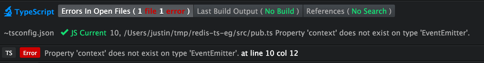
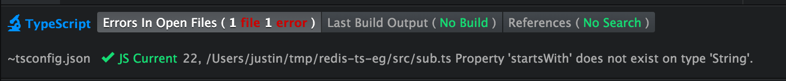

## Intro

The intention was to write some demo code to see what problems I come across while just starting to use [Typescript](https://www.typescriptlang.org/), and to document the "work-arounds" along the way. This is a suitable read for anyone who knows what Typescript is, is interested in it, but hasn't really used it before. You should have [Redis](http://redis.io/) installed (as well as Node and Typescript) to follow along.

I'm using the [Atom](https://atom.io/) text editor with the [atom-typescript](https://github.com/TypeStrong/atom-typescript) package.

A repo for the code in this post is up on [Github](https://github.com/justin-calleja/redis-ts-eg). Use `npm install && typings install` to get started.

## The demo

We're going to have 2 scripts to run, `pub.js` and `sub.js`. `pub.js` will just start up a Node [REPL](https://nodejs.org/api/repl.html) exposing a `redisClient` which we can use to publish messages on channels with. `sub.js` will be subscribing to channels and listening to messages published by `pub.js`.

Below is a quick session for illustration:


Simple, but making the compiler happy took a bit of fiddling.

## pub.ts

### tsconfig.json

```bash
$ mkdir redis-ts-eg && cd redis-ts-eg
redis-ts-eg$ npm init --yes
redis-ts-eg$ npm i -S redis
redis-ts-eg$ mkdir src lib
```

If you now open `redis-ts-eg` in Atom and create `pub.ts` (note the `ts` extension) in `src`, you should get the following error (and suggestion):


We're missing a [tsconfig.json](https://www.typescriptlang.org/docs/handbook/tsconfig-json.html) [file](https://github.com/TypeStrong/atom-typescript/blob/master/docs/tsconfig.md) and we can get [atom-typescript](https://github.com/TypeStrong/atom-typescript) to create one for us using the Atom [command-palette](https://atom.io/packages/command-palette) by hitting `cmd-shift-p` (OSX) or `ctrl-shift-p` (Linux/Windows).

Once you have that open, start typing "create tsconfig.json" and you should get the option to select. This creates the file in `src`, so just move it one directory up to the project root.

So what is `tsconfig.json` anyway?

<blockquote>A unified project format for TypeScript… The TypeScript compiler (1.5 and above) only cares about *compilerOptions* and *files*<footer><cite><a href="https://github.com/TypeStrong/atom-typescript/blob/master/docs/tsconfig.md#tsconfigjson">tsconfig.json atom-typescript doc</a></cite></footer></blockquote>

Ok, so [compilerOptions](https://www.typescriptlang.org/docs/handbook/compiler-options.html) and *files* are passed to the Typescript compiler, but this isn't to say that `tsconfig.json` is an [atom-typescript](https://github.com/TypeStrong/atom-typescript) only thing:

<blockquote>
Using tsconfig.json:

<ul><li>By invoking tsc with no input files, in which case the compiler searches for the tsconfig.json file starting in the current directory and continuing up the parent directory chain.</li><li>By invoking tsc with no input files and a --project (or just -p) command line option that specifies the path of a directory containing a tsconfig.json file.</li></ul>When input files are specified on the command line, tsconfig.json files are ignored.
<footer><cite><a href="https://www.typescriptlang.org/docs/handbook/tsconfig-json.html">tsconfig.json Typescript doc</a></cite></footer></blockquote>

i.e. both Typescript and atom-typescript use the file (the teams behind each collaborate to avoid conflicts). 

In `tsconfig.json`, [filesGlob](https://github.com/TypeStrong/atom-typescript/blob/master/docs/tsconfig.md#filesglob) is a field used by atom-typescript to keep `files` up to date. i.e. any files matched by `filesGlob` are automatically (and individually) listed by Atom in `files` (which *is* used by `tsc`, the Typescript compiler).

```json
"filesGlob": [
    "**/*.ts",
    "**/*.tsx",
    "!node_modules/**"
],
```

### typings

Great, so I guess we're ready to start coding now:

```ts
import redis = require('redis');
```


Not so fast. We're importing `redis` (Typescript style) but the compiler knows nothing about it. To fix this we'll use [typings](https://github.com/typings/typings), the Typescript Definition Manager, to fetch a description of what the `redis` module is (i.e. a `.d.ts` file).

```bash
redis-ts-eg$ # Install Typings CLI utility if you don't already have it
redis-ts-eg$ npm install typings --global
redis-ts-eg$ typings --version
1.0.4
redis-ts-eg$ typings search redis
Viewing 5 of 5

NAME            SOURCE HOMEPAGE                                    DESCRIPTION VERSIONS UPDATED
node_redis      dt     https://github.com/mranney/node_redis                   1        2016-03-16T15:55:26.000Z
redis           npm    https://www.npmjs.com/package/redis                     1        2016-05-02T17:09:35.000Z
redis           dt     https://github.com/mranney/node_redis                   1        2016-03-16T15:55:26.000Z
socket.io-redis dt     https://github.com/socketio/socket.io-redis             1        2016-04-01T04:54:12.000Z
ioredis         dt     https://github.com/luin/ioredis                         1        2016-05-21T15:26:53.000Z
```

You can tell typings to install from one of these [sources](https://github.com/typings/typings#sources) (assuming a type definition is available at a given source - something you can confirm through searching as done above). `npm` is the default (configurable through `defaultSource` in `.typingsrc`).

```bash
redis-ts-eg$ typings install redis --save
```

After installing, you should get a `typings.json` file and a `typings` directory. If you save `tsconfig.json` now, it should update `files` to:

```json
"files": [
    "src/pub.ts",
    "typings/index.d.ts",
    "typings/modules/redis/index.d.ts"
],
```

It would work just as well without `typings/modules/redis/index.d.ts` as `typings/index.d.ts` references it. In any case, the "Cannot find module 'redis'" error should be gone now (try closing and re-opening the file if not).

Before continuing, notice that the compiler generates `src/pub.js` (even when we had an error - Typescript will still transpile to Javascript even with errors). To move the compiler's output to `lib` we can add the following to `compilerOptions` in `tsconfig.json`:

```json
"compilerOptions": {
  "outDir": "lib",
  ...
```

Saving `pub.ts` now should generate `pub.js` in `lib`.

We can move on by importing the next module we'll need and going through a similar process as with the `redis` module:

```ts
import repl = require('repl');
```

[repl](https://nodejs.org/api/repl.html) is a module that comes with the Node distribution, but `tsc` has no knowledge of it.

```bash
redis-ts-eg$ typings search node
Viewing 20 of 212

NAME                          SOURCE HOMEPAGE                                           DESCRIPTION VERSIONS UPDATED
analytics-node                dt     https://segment.com/docs/libraries/node/                       1        2016-03-17T12:06:54.000Z
i18next-node-fs-backend       dt     https://github.com/i18next/i18next-node-fs-backend             1        2016-03-19T10:37:45.000Z
i18n-node                     dt     https://github.com/mashpie/i18n-node                           1        2016-05-21T15:25:45.000Z
jasmine-node                  dt     https://github.com/mhevery/jasmine-node                        1        2016-03-16T15:55:26.000Z
jasmine-node-promise-matchers global                                                                1        2016-03-10T14:35:55.000Z
kafka-node                    dt     https://github.com/SOHU-Co/kafka-node/                         1        2016-03-16T15:55:26.000Z
mocha-node                    dt     http://mochajs.org/                                            1        2016-03-17T12:06:54.000Z
moment-node                   dt     https://github.com/timrwood/moment                             1        2016-05-11T04:33:38.000Z
node                          dt     http://nodejs.org/                                             5        2016-05-23T03:57:54.000Z
node                          env                                                                   5        2016-05-07T21:03:04.000Z
node-4                        dt     http://nodejs.org/                                             1        2016-05-14T16:59:20.000Z
node-array-ext                dt     https://github.com/Beng89/node-array-ext                       1        2016-03-16T15:55:26.000Z
node-azure/azure              dt     https://github.com/WindowsAzure/azure-sdk-for-node             1        2016-03-16T15:55:26.000Z
node-cache                    dt     https://github.com/tcs-de/nodecache                            1        2016-03-17T12:06:54.000Z
node-calendar                 dt     https://www.npmjs.com/package/node-calendar                    1        2016-03-16T15:55:26.000Z
node-config-manager           dt     https://www.npmjs.com/package/node-config-manager              1        2016-03-16T15:55:26.000Z
node-dir                      dt     https://github.com/fshost/node-dir                             1        2016-03-16T15:55:26.000Z
node-ffi                      dt     https://github.com/rbranson/node-ffi                           1        2016-03-16T15:55:26.000Z
node-ffi/node-ffi-buffer      dt                                                                    1        2014-06-18T21:31:11.000Z
node-fibers                   dt     https://github.com/laverdet/node-fibers                        1        2016-03-17T12:06:54.000Z
```

After searching, you'll see we get two options from the list above, one with a source of `dt`, and one with a source of `env`. I've tried installing both and they're identical in their `repl` definitions so we'll just pick one:

```bash
redis-ts-eg$ typings install dt~node --save --global
```

From what I can tell, we need to use `--global` with this one because of the contents of the definitions in its `.d.ts` (i.e. `typings/globals/node/index.d.ts`). Unlike the redis one, not everything in this `.d.ts` file is wrapped around a module declaration which exports the desired definitions. Instead, there are global definitions like these:

```ts
declare var process: NodeJS.Process;
declare var global: NodeJS.Global;

declare var __filename: string;
declare var __dirname: string;

declare function setTimeout(callback: (...args: any[]) => void, ms: number, ...args: any[]): NodeJS.Timer;
declare function clearTimeout(timeoutId: NodeJS.Timer): void;
// etc…
```

This is as opposed to contained (wrapped in a module) type definitions like the ones for redis which are scoped to a variable after importing the redis module.

Apparently, typings can make this distinction because it will fail to install `dt~node` without the `--global` flag.

In any case, the compiler now knows about `repl` so we can finish off `pub.ts`:

```ts
import redis = require('redis');
import repl = require('repl');

let redisClient = redis.createClient();

let replServer = repl.start({
  prompt: '>> '
});

replServer.context.redisClient = redisClient;
```

Which gives us our next challenge:



### Adding context

The following is what the compiler knows about the `repl` module from `typings/globals/node/index.d.ts` (which should be automatically added to your `tsconfig.json` thanks to `atom-typescript`):

```ts
declare module "repl" {
    import * as stream from "stream";
    import * as events from "events";

    export interface ReplOptions {
        prompt?: string;
        input?: NodeJS.ReadableStream;
        output?: NodeJS.WritableStream;
        terminal?: boolean;
        eval?: Function;
        useColors?: boolean;
        useGlobal?: boolean;
        ignoreUndefined?: boolean;
        writer?: Function;
    }
    export function start(options: ReplOptions): events.EventEmitter;
}
```

No mention of `context` anywhere. The easiest thing to do would be to add it right there. But what are we going to do in the next project which needs the same thing? Repeat the operation? Not fun.

At this point you could start managing your own `index.d.ts` for Node. Maybe submit a pull request with your changes and hope they get added. By managing your own type definitions in a repo you manage, you can import them into your code and re-use them.

However, for a throw-away project like this, I'd rather not have to stay doing this. Instead, I'll just add a `typingslocal` directory to this project and add type definitions extending existing ones there.

**Note**: the name is important if you want to keep `atom-typesript`'s auto management of the `files` field in `tsconfig.json`. We want definition files under `typingslocal` to be listed **below** those in `typings`. That should be the case with `typingslocal` (it is for me), but if for some reason this ordering changes with whatever version of `atom-typescript` you're using, it's best to set `rewriteTsconfig` to `off` (in tsconfig.json) and manage `files` yourself. That way you can make sure that `d.ts` files in `typingslocal` are listed after the ones in `typings` in `tsconfig.json`'s `files` field.

It seems to me that all we need to do in this case is define our own type extending `EventEmitter`, giving it a context and using that type for the return value of `start`:

```ts
// typingslocal/global/node/index.d.ts
declare module "repl" {
  import * as events from "events";

  interface ReplEventEmitter extends events.EventEmitter {
    context: any;
  }

  export function start(options: ReplOptions): ReplEventEmitter;
}
```

After saving `tsconfig.json`, `files` should refresh and the error in `pub.ts` should go away.

## sub.ts

Moving on to `sub.ts` - if you copy-paste the following, you'll find that the compiler is only unaware of the `startsWith` method on strings:

```ts
import redis = require('redis');

let redisClient = redis.createClient();

let defaultChannel = 'helloChannel';
let args = process.argv.slice(2);
let channelName: string = args[0] || defaultChannel;

function subscribe(redisClient, channelName) {
  redisClient.subscribe(channelName, (err, channel) => {
    if (err) throw err;
    console.log(`now listening on channel: '${channelName}'`);
  });
}

redisClient.on('error', console.error);

redisClient.on('message', (channelName, msg: String) => {
  console.log(`${channelName}: ${msg}`);
  if (msg === '/unsubscribe') {
    redisClient.unsubscribe(channelName);
  } else if (msg.startsWith('/subscribe')) {
    let channel = msg.split(' ').slice(1).join(' ');
    subscribe(redisClient, channel);
  }
});

redisClient.on('unsubscribe', (channelName, count) => {
  console.log(`unsubscribing from ${channelName}. Client is now listening to ${count} channel(s)`);
  if (count === 0) {
    console.log('no more subscriptions; exiting…');
    process.exit();
  }
});

redisClient.on('subscribe', (channelName, count) => {
  console.log(`listening on channel: ${channelName}. Client is now listening to ${count} channel(s)`);
});

subscribe(redisClient, channelName);
```



Clearly, we need to teach the compiler about `startsWith` (Node, which is what we'll be running on, has this method already defined on the String prototype… we just need to make the compiler happy).

I came across a way to do this [here](http://www.mzan.com/article/36432983-extension-methods-in-typescript-system.shtml). It is based on "global augmentation":

<blockquote>TypeScript also has the notion of global augmentations of the form `declare global { }`. This allows modules to augment global types such as `Array` if necessary.<footer><cite><a href="https://www.typescriptlang.org/docs/release-notes/typescript-1.8.html">Augmenting global/module scope from modules</a></cite></footer></blockquote>

An example of augmenting `Array` is given in the [1.8 release notes](https://www.typescriptlang.org/docs/release-notes/typescript-1.8.html):

```ts
// Ensure this is treated as a module.
export {};

declare global {
    interface Array<T> {
        mapToNumbers(): number[];
    }
}
```

Following this pattern, we can fix our issue with:

```ts
// typingslocal/globals/runtime/index.d.ts
export {}

declare global {
  interface String {
    startsWith(searchString: string, position?: number): boolean;
  }
}
```

Note: if the use of an empty export to ensure the file is treated as a module doesn't make sense to you, read [this](https://basarat.gitbooks.io/typescript/content/docs/project/modules.html).

You should now have no compiler errors and be able to run the 2 scripts as shown in the demo at the start of this post.

## Conclusion

This post was meant as a "how-to" for people (and by someone) just getting started with Typescript. We've seen a lot of friction from the compiler and zero opportunities for it to help us (using JS would have been much easier for this demo). This can be expected to change as we start defining our own types and our code base gets larger :)
