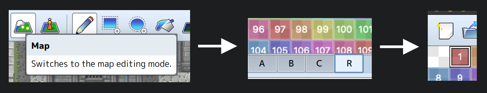
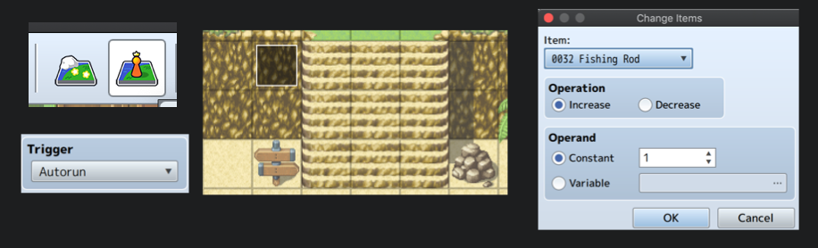

## Prerequisites

- You have RPG maker MZ or MV - I'm using MZ but I think it'll work just as well with MV.
- You've gone through the tutorials that come with the program at `Help ➜ Tutorial`.

At least that was my previous exp before doing this.

## Objective

I'm just starting out with RPG maker and am trying to get some practice. I found this post which I'll be re-producing here (in more detail / pictures 🙂):

<InfoBox style={{ textAlign: "center" }}>
  <a href="https://www.xehryn.com/tutorials/fishing-regions" target="_blank">
    https://www.xehryn.com/tutorials/fishing-regions
  </a>
</InfoBox>

The gist is:

- Be able to use an item called "Fishing Rod"
- If the tile in front of the player is not somewhere where fishing is allowed, the player gets "Can't fish here..."
- If fishing is allowed, they get a message with the id of the fish that would have been caught assuming there was actually a fishing system implemented.

## Add a region id to areas of interest

1. Create a project e.g. "FishingEvent".
1. Add a map with some water in it and set the player's starting position to somewhere close to the water:
   
1. Pick and apply a `Region Id` (e.g. 1) to anywhere you want the player to be able to fish at.
   - Note how you need to be in "Map" mode and that you select the **R** tab.
     
     

## Create and equip the "Fishing Rod"

1. From `Database ➜ Items`, (possibly change the maximum number of items), and add a "Fishing Rod" item, and (optionally) two fish items e.g. "Fish A" and "Fish B". I'm following the [original source material](https://www.xehryn.com/tutorials/fishing-regions) and choosing an item type of **Key Item** and setting the scope to **None** and occasion to **Always** for the "Fishing Rod".
   - Icons don't matter - they're just fillers.
     
1. **Equip the Fishing Rod by adding an autorun event:** On scene start, in order to equip the player with the "Fishing Rod"; change to "Event mode" for the map, and place an event by double clicking on a tile which won't be interacted with (see e.g. in screenshot below).
   - Set the event's Trigger to **Autorun**
   - Double click first line of the event's "Contents" and choose `Party ➜ Change Items` from the first tab of the new window.
   - As in the "Change Items" window screenshot below, choose the "Fishing Rod" with an operation of **Increase** and a constant of **1**.
   - Double click on the next line in the event's "Contents" and choose `Game Progression ➜ Control Self Switch` and select as shown in screenshot (i.e. self switch A to **ON**).
     - The reason for doing this is so that a new event page can be created with a condition to be active when the self switch A is **ON**. This prevents the event from triggering the next time we load this scene i.e. it prevents the event from gifting the player a "Fishing Rod" over and over again.
   - The first page of the event only needs the `Change Items` and `Control Self Switch`. Next; add a "New Event Page" by clicking the button with the same name.
   - Finally, set the new page's condition to self switch **A**. No contents are necessary.
     
     

At this point you should be able to play the game and check that you have a "Fishing Rod" under `Item ➜ Key Item`.

Now to implement the:

<InfoBox>
  Check tile in front of player's current direction to see if it's somewhere you
  can fish in i.e. to check if it's marked with Region Id 1 - and then react
  appropriately.
</InfoBox>

## Add a common event named "Try Fishing"

In `Database`, add a common event: "Try Fishing", and add a **script** as it's first line in "Contents":


### Script to store the region id of tile in front of player in game variable 3

The script I'm just copy/pasting from the [source material](https://www.xehryn.com/tutorials/fishing-regions):

```js
x = $gamePlayer.x
y = $gamePlayer.y
// prettier-ignore
switch($gamePlayer.direction()){
case 2: y += 1; break;
case 4: x -= 1; break;
case 6: x += 1; break;
case 8: y -= 1; break;
}
region = $gameMap.regionId(x, y)
$gameVariables.setValue(3, region)
```

The `// prettier-ignore` comment is just something I added to stop the `switch` statement from being formatted by <a href="https://prettier.io/" target="_blank">prettier</a> in the markdown file I'm writing this in. I'm writing about this as it has led to me learning something new actually… this is how the code snippet looks when formatted:

```js
x = $gamePlayer.x
y = $gamePlayer.y
switch ($gamePlayer.direction()) {
  case 2:
    y += 1
    break
  case 4:
    x -= 1
    break
  case 6:
    x += 1
    break
  case 8:
    y -= 1
    break
}
region = $gameMap.regionId(x, y)
$gameVariables.setValue(3, region)
```

And if I try using this version instead:


Looks like I only get a max of 12 lines of code to put there…

<div style="text-align: center">
  
</div>

I'm sure there's got to be a way around this. Maybe by adding a function in the `plugins` directory and referring to it here (there's a "Plugin Command" option). Still - I don't understand why the restriction is necessary 🤔. Anyway, moving on…

Note the last line in the snippet - `$gameVariables.setValue(3, region)` - that's setting the Region Id of the tile just in front of the player's currently facing direction to the "3rd game variable". Also note that `$gameMap.regionId(x, y)` will give `0` for an `x` and `y` that do not land on a a tile marked as having a region id.

### The rest of the common event's contents…

… looks something like this:


To get the first check:


Note the creation of the variable at slot number `0003` - that I named "RegionId". That one was chosen to line up with the population of that variable in our previous script: `$gameVariables.setValue(3, region)`.

In this case, given that the region id is `0`, the next 2 steps in the `if` can be:

- Message ➜ Show text
- Flow Control ➜ Exit Event Processing

The next `if` can be to check for a region id of `1` using the same approach as before - just changing the **Constant** radio selection's corresponding value to `1` instead of `0`. In this case, I'll do as is in the [original source material](https://www.xehryn.com/tutorials/fishing-regions) and introduce another variable to store what kind of fish can be caught in the matched region (region `1` in this case). The variable number chosen is that of `4` this time. The number assigned to variable `4` is an **arbitrary** id our game will use to identify a given fish:

<blockquote>
  Now for determining fish for valid Region IDs. This is as simple as just using
  a conditional branch to check the Region ID number, and setting a variable
  Fish ID to whatever fish we want to appear for that region. Note that Fish ID
  isn't the same as an item ID in the database! It's simply a way to keep track
  of types of fish in your game, and it can be whatever you want. You may choose
  the item ID as the Fish ID if it makes things easier.
  <footer>
    <cite>
      <a
        href="https://www.xehryn.com/tutorials/fishing-regions"
        target="_blank"
      >
        Xehryn's fishing-regions blog post
      </a>
    </cite>
  </footer>
</blockquote>


See [original source material](https://www.xehryn.com/tutorials/fishing-regions) for how to get a random fish id from a list using this script:

```js
fish = [1, 2, 5, 8, 10]
fid = fish[Math.floor(Math.random() * fish.length)]
// NOTE: again, not that variable number 4 is storing the fish id:
$gameVariables.setValue(4, fid)
```

The last content of the "Try Fishing" common event will be a call to another common event which currently isn't defined yet. There's still an option to choose from a drop down list of empty common events, so I'll just pick the second one in the list and "Try Fishing"'s contents should now look something like this:


## Add "Try Fishing" as an effect of using "Fishing Rod"

Now that "Try Fishing" is defined, it can be added as an effect of using the "Fishing Rod" (in `Database ➜ Items`):


## Add another common event named "Fishing"

Finally, name the 2nd common event to something sensible like "Fishing" and show what's in variable number `4` with `\V[4]`:


You should now be able to play test the sample and get "Can't fish here..." or "You caught a fish with id 5" depending on where you use the fishing rod.

## Getting around the UI limitation

Re the UI limitation that only lets us input 12 lines of code - it's actually just that - a UI limitation in the window that displays the text area to input our code. It's actually no problem to input more code - it's just annoying to do.

Start by opening the project in an editor like <a href="https://code.visualstudio.com/" target="_blank">Visual Studio Code</a> (by opening the project folder which you can access via menu item: `Game ➜ Open Folder`). Then open the file `data/CommonEvents.json`, and format it to see what's going on (mac: `Cmd+Shift+P`, win: `Ctrl+Shift+P` - and start typing "format document").

You can simply edit the object with `name` `Try Fishing` (or `id` `1` if you used the first slot for the common event) to look like this:

```json
{
  "id": 1,
  "list": [
    { "code": 355, "indent": 0, "parameters": ["x = $gamePlayer.x"] },
    { "code": 655, "indent": 0, "parameters": ["y = $gamePlayer.y"] },
    {
      "code": 655,
      "indent": 0,
      "parameters": ["switch ($gamePlayer.direction()) {"]
    },
    { "code": 655, "indent": 0, "parameters": ["  case 2:"] },
    { "code": 655, "indent": 0, "parameters": ["    y += 1"] },
    { "code": 655, "indent": 0, "parameters": ["    break"] },
    { "code": 655, "indent": 0, "parameters": ["  case 4:"] },
    { "code": 655, "indent": 0, "parameters": ["    x -= 1"] },
    { "code": 655, "indent": 0, "parameters": ["    break"] },
    { "code": 655, "indent": 0, "parameters": ["  case 6:"] },
    { "code": 655, "indent": 0, "parameters": ["    x += 1"] },
    { "code": 655, "indent": 0, "parameters": ["    break"] },
    { "code": 655, "indent": 0, "parameters": ["  case 8:"] },
    { "code": 655, "indent": 0, "parameters": ["    y -= 1"] },
    { "code": 655, "indent": 0, "parameters": ["    break"] },
    { "code": 655, "indent": 0, "parameters": ["}"] },
    {
      "code": 655,
      "indent": 0,
      "parameters": ["region = $gameMap.regionId(x, y)"]
    },
    {
      "code": 655,
      "indent": 0,
      "parameters": ["$gameVariables.setValue(3, region)"]
    },
    { "code": 111, "indent": 0, "parameters": [1, 3, 0, 0, 0] },
    { "code": 101, "indent": 1, "parameters": ["", 0, 0, 2, ""] },
    { "code": 401, "indent": 1, "parameters": ["Can't fish here..."] },
    { "code": 115, "indent": 1, "parameters": [] },
    { "code": 0, "indent": 1, "parameters": [] },
    { "code": 412, "indent": 0, "parameters": [] },
    { "code": 111, "indent": 0, "parameters": [1, 3, 0, 1, 0] },
    { "code": 122, "indent": 1, "parameters": [4, 4, 0, 0, 5] },
    { "code": 0, "indent": 1, "parameters": [] },
    { "code": 412, "indent": 0, "parameters": [] },
    { "code": 117, "indent": 0, "parameters": [2] },
    { "code": 0, "indent": 0, "parameters": [] }
  ],
  "name": "Try Fishing",
  "switchId": 1,
  "trigger": 0
}
```

Save and accept RPG Maker's reload popup window. Then go back to `Database ➜ Common Events` and you should now see that "Try Fishing" now includes all the required code:


Running the game won't crash now (as opposed to what results when we copy/paste the longer version of the code using RPG Maker's `Script` input for Common Events).

Not the best UX but it's always good to know how to re-use stuff from one project to another.

## Using a Plugin Command

To use a `Plugin Command`, first create a plugin. In `js/plugins` create a file e.g. `MyPlugin.js` and put the following into it:

```js
//=============================================================================
// RPG Maker MZ - MyPlugin
//=============================================================================

/*:
 * @target MZ
 * @plugindesc Collection of commands
 * @author Justin Calleja
 *
 * @help MyPlugin.js
 *
 * @command setGV3
 * @text Set game variable 3
 * @desc Game variable 3 will be set to the region id of the tile directly in front of the player.
 *
 */

;(() => {
  const pluginName = "MyPlugin"

  PluginManager.registerCommand(pluginName, "setGV3", () => {
    x = $gamePlayer.x
    y = $gamePlayer.y
    switch ($gamePlayer.direction()) {
      case 2:
        y += 1
        break
      case 4:
        x -= 1
        break
      case 6:
        x += 1
        break
      case 8:
        y -= 1
        break
    }
    region = $gameMap.regionId(x, y)
    $gameVariables.setValue(3, region)
  })
})()
```

This is the first plugin I've made by copy/pasting the existing `TextPicture.js` plugin and a bit of research. I'm not 100% sure about it, but probably `setGV3` in this:

```js
 * @command setGV3
```

and this:

```js
  PluginManager.registerCommand(pluginName, 'setGV3', () => {
```

need to match. Users of the plugin will see the text for the `@text` annotation "Set game variable 3" when selecting this command from the plugin. Anyway, this lets you write more than 12 lines of code 🙂 - what luxury!

To use it, first enable the plugin by going to `Tools ➜ Plugin Manager` and double clicking on one of the empty rows. Then select it from the window that pops up after clicking on "Name":


I went ahead and created a new Common Event to test it:


Basically, I've replaced the existing "Script" with a:

> ◆Plugin Command：MyPlugin, Set game variable 3

… and I changed the text for the case where it's region id `0` to differentiate it from the "Try Fishing" one.

The final step before testing this out is to use the new Common Event for the "Fishing Rod" via `Database ➜ Items`.

---

In case you're wondering what the `TextPicture` Common Event is in the screenshot above, it's this:

```
◆Plugin Command：TextPicture, Set Text Picture
：              ：Text = Hello world...
◆Show Picture：#1, None, Upper Left (0,0), (100%,100%), 255, Normal
```

Try adding the `TextPicture` plugin and giving it a go.
