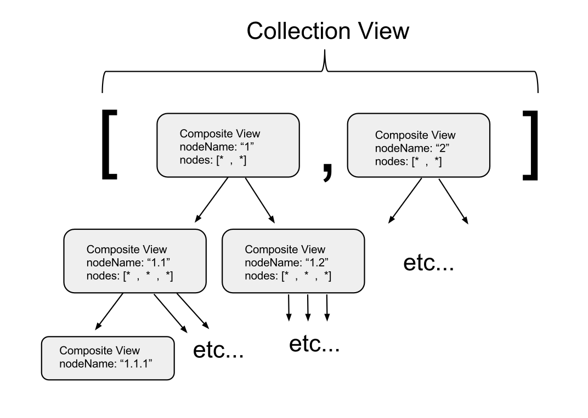

## Intro

This post is based off of an example used in the book [Better Backbone Applications with MarionetteJS](https://shop.smashingmagazine.com/better-backbone-applications-with-marionettejs.html "Better Backbone Applications with MarionetteJS") by [Joe Zimmerman](http://www.joezimjs.com/ "Joe Zimmerman"). More specifically, it's the recursive data example rendered by a combination of Collection and Composite views in Chapter 6 (itself based off of the following blog post by [Derick Bailey](http://derickbailey.com/ "Derick Bailey"): [Composite Views: Tree Structures, Tables, And More](http://lostechies.com/derickbailey/2012/04/05/composite-views-tree-structures-tables-and-more/ "Composite Views: Tree Structures, Tables, And More")).

I wasn't sure I understood what was really going on in that example, so after reading the chapter, I decided to type it in and play around a bit. This post is just a description of that process (the end result [is up on Github](https://github.com/justin-calleja/compositeview-eg "compositeview-eg")).

I will be implementing it using AMD modules and including the few changes necessary to get it to work in [Marionette](http://marionettejs.com/ "MarionetteJS") version 2.3.2 (the latest at time of writing). For a more detailed explanation of the example and the Marionette concepts used in it, have a look at [Better Backbone Applications with MarionetteJS](https://shop.smashingmagazine.com/better-backbone-applications-with-marionettejs.html "Better Backbone Applications with MarionetteJS"). I am in no way affilated with a third party and receive 0 benefit if you decide to purchase. That said, I feel confident recommending it based off of the value I've received from reading it.

### High level aim

Basically, we want to go from:

```js
;[
  {
    nodeName: "1",
    nodes: [
      {
        nodeName: "1.1",
        nodes: [
          { nodeName: "1.1.1" },
          { nodeName: "1.1.2" },
          { nodeName: "1.1.3" },
        ],
      },
      {
        nodeName: "1.2",
        nodes: [
          { nodeName: "1.2.1" },
          {
            nodeName: "1.2.2",
            nodes: [
              { nodeName: "1.2.2.1" },
              { nodeName: "1.2.2.2" },
              { nodeName: "1.2.2.3" },
            ],
          },
          { nodeName: "1.2.3" },
        ],
      },
    ],
  },
  {
    nodeName: "2",
    nodes: [
      {
        nodeName: "2.1",
        nodes: [
          { nodeName: "2.1.1" },
          { nodeName: "2.1.2" },
          { nodeName: "2.1.3" },
        ],
      },
      {
        nodeName: "2.2",
        nodes: [
          { nodeName: "2.2.1" },
          { nodeName: "2.2.2" },
          { nodeName: "2.2.3" },
        ],
      },
    ],
  },
]
```

to:

<div data-tree-container></div>

## Setting up

- Install Bower globally if you don't already have it: `npm i -g bower`
- `npm init`
- `mkdir -p app/lib app/js`
- `vim .bowerrc`

```js
{
  "directory": "app/lib"
}
```

- `bower init`
- `bower i --save marionette lodash requirejs`

```md
compositeview-eg\$ ls app/lib/
backbone backbone.wreqr lodash requirejs
backbone.babysitter jquery marionette underscore
```

I am using both [Npm](https://www.npmjs.com/ "Npm") and [Bower](http://bower.io/ "Bower") to manage dependencies. Dependencies brought in by Npm will be used in developing the project (e.g. bringing in [Grunt](http://gruntjs.com/ "Grunt") to automate tasks, or installing Bower so our project can use a different kind of dependency manager). Dependencies brought in by Bower will be used by the web application we're building (i.e. these are the files consumed by the browser when it loads our application). If you're thinking "why use 2 separate dependency managers?", have a look at this [SO question](http://stackoverflow.com/questions/18641899/difference-between-bower-and-npm "difference between bower and npm").

Basically, Npm makes use of nested dependencies which allows each dependency to have a copy of its own dependencies while Bower uses flat dependencies which means that when you bring in a dependency with Bower it will not include its own dependencies. So in the e.g. above, using Bower to bring in Marionette also gives us its dependencies, e.g. [Underscore](http://underscorejs.org/ "Underscore") and [Backbone](http://backbonejs.org/ "Backbone"), but these dependencies are outside of Marionette. Backbone, which also depends on Underscore, does not have its own copy of Underscore. So Underscore is shared by any dependency which needs it. This is great for pulling in dependencies which will be consumed by a browser since you do not want to load in several copies of a dependency in your application. On the server side, however, size doesn't matter as much and using Npm allows us to cleanly use dependencies which have the correct version of their own dependencies (there are cases when this is not possible, e.g. plugins. You can read more about this at the [NodeJS blog](http://blog.nodejs.org/2013/02/07/peer-dependencies/ "NodeJS Blog")).

Next up, we'll configure our AMD loader and log out one of our dependencies to get some kind of indication that we're on the right track.

`vim app/js/main.js`

```js
/*global require*/
"use strict"

require.config({
  paths: {
    jquery: "../lib/jquery/dist/jquery",
    backbone: "../lib/backbone/backbone",
    marionette: "../lib/marionette/lib/core/backbone.marionette",
    "backbone.wreqr": "../lib/backbone.wreqr/lib/backbone.wreqr",
    "backbone.babysitter": "../lib/backbone.babysitter/lib/backbone.babysitter",
    underscore: "../lib/lodash/lodash",
  },
})

require(["marionette"], function (Marionette) {
  console.log("Marionette:", Marionette)
})
```

If you look inside `app/lib/marionette` you will notice that there are two Marionette scripts we could be pulling in, one in `marionette/lib` and one in `marionette/lib/core`. Both of these depend on [Babysitter](https://github.com/marionettejs/backbone.babysitter "Babysitter") and [Wreqr](https://github.com/marionettejs/backbone.wreqr "Wreqr") but the one in core pulls them in while the one outside core has these dependencies baked into its own source.

<blockquote>
  <p>
    These pre-requisites are still required for Marionette to run, but this
    allows you to download them separately and update them independently.
  </p>
  <footer>
    <cite>
      <a href="http://marionettejs.com/">MarionetteJS</a>
    </cite>
  </footer>
</blockquote>

Also, if you open up `marionette/lib/core/backbone.marionette.js` you will notice that it is requiring these pre-requisites using the following aliases:

```js
var Wreqr = require("backbone.wreqr")
var BabySitter = require("backbone.babysitter")
```

... which is why we're using the same alias names for the paths to these two dependencies in our AMD configuration.

The last thing we need in place to have something to serve is our index file: `vim app/index.html`

```html
<!DOCTYPE html>
<html lang="en">
  <head>
    <meta charset="UTF-8" />
    <title></title>
  </head>
  <body>
    <script data-main="js/main" src="lib/requirejs/require.js"></script>
  </body>
</html>
```

The `script` tag pulls in RequireJS from our Bower installed dependencies and configures it with the main.js file defined above. Finally, we can start some kind of server and check our progress:

- `npm install -g live-server`
- `cd app && live-server`

... and you should get the console output from our main.js file.

## Start

### The data

We'll start off by defining how our data will be stored as Models and Collections:

`vim app/js/tree/TreeNode.js`

```js
/*global define*/

define(["backbone"], function (Backbone) {
  "use strict"

  var NodeModel = Backbone.Model.extend({
    initialize: function () {
      var nodes = this.get("nodes")
      // Covert nodes to a NodeCollection
      this.set("nodes", new NodeCollection(nodes))
    },

    toJSON: function () {
      // Call parent's toJSON method
      var data = Backbone.Model.prototype.toJSON.call(this)
      if (data.nodes && data.nodes.toJSON) {
        // If nodes is a collection, convert it to JSON
        data.nodes = data.nodes.toJSON()
      }
      return data
    },
  })

  var NodeCollection = Backbone.Collection.extend({
    model: NodeModel,
  })

  return {
    Model: NodeModel,
    Collection: NodeCollection,
  }
})
```

Notice how we define both the Model and the Collection in the same module since they are interdependent. We could not separate these into their own separate module as each definition would depend on the other being loaded and this would inevitably lead to undefined imports when running it in our browser.

Also notice that upon initialization, NodeModel will look for a _nodes_ attribute and encapsulate it in a new _NodeCollection_. A NodeCollection is itself a collection of NodeModels and so the process will repeat as long a given NodeModel contains any nodes. A similar process takes place when deserializing the Model's state in _toJSON_.

With that in place, leave live-server running and change _main.js_ to use TreeNode:

```js
require(["tree/TreeNode"], function (TreeNode) {
  console.log("TreeNode.Model:", TreeNode.Model)
  console.log("TreeNode.Collection:", TreeNode.Collection)
})
```

Again, you should see the relevant changes in the console.

We'll now add the data from which we will be creating our models and collections:

`vim app/js/tree/nodeData.js`

```js
/*global define*/

define(function () {
  "use strict"

  return [
    {
      nodeName: "1",
      nodes: [
        {
          nodeName: "1.1",
          nodes: [
            { nodeName: "1.1.1" },
            { nodeName: "1.1.2" },
            { nodeName: "1.1.3" },
          ],
        },
        {
          nodeName: "1.2",
          nodes: [
            { nodeName: "1.2.1" },
            {
              nodeName: "1.2.2",
              nodes: [
                { nodeName: "1.2.2.1" },
                { nodeName: "1.2.2.2" },
                { nodeName: "1.2.2.3" },
              ],
            },
            { nodeName: "1.2.3" },
          ],
        },
      ],
    },
    {
      nodeName: "2",
      nodes: [
        {
          nodeName: "2.1",
          nodes: [
            { nodeName: "2.1.1" },
            { nodeName: "2.1.2" },
            { nodeName: "2.1.3" },
          ],
        },
        {
          nodeName: "2.2",
          nodes: [
            { nodeName: "2.2.1" },
            { nodeName: "2.2.2" },
            { nodeName: "2.2.3" },
          ],
        },
      ],
    },
  ]
})
```

At this stage, if you want to experiment a bit with what we have, you could create a TreeNode.Collection in main.js like so:

```js
require(["tree/TreeNode", "tree/nodeData"], function (TreeNode, nodeData) {
  var nodes = new TreeNode.Collection(nodeData)
  window.nodes = nodes
  console.log(nodes)
})
```

### The views

We'll now turn our attention to rendering our data in the browser. For this we'll be using both Marionette's [CompositeView](http://marionettejs.com/docs/v2.3.2/marionette.compositeview.html) and [CollectionView](http://marionettejs.com/docs/v2.3.2/marionette.collectionview.html) capabilities.

Take another look at the data structure shown at the beginning of [High level aim](#toc_1). You will notice that we're working with an array with two objects inside it. Each object in the array may contain a _nodes_ array which itself is made up of objects which may or may not contain a _nodes_ array. We can consider each of these objects as nodes in a tree, with the node at the top level array as the root and any nodes with no children as leaves.

This is probably easier to illustrate with a diagram than to describe in words:



This diagram also shows where the Marionette Views come into play. Note that there is only one collection shown in this diagram which is backed by a CollectionView - the top level collection containing the root CompositeView nodes. The _nodes_ collection within each CompositeView is not backed by a CollectionView. They are just the CompositeView's collection.

A CompositeView is made up of both a model _and_ a collection. It has it's own template, which is the "wrapper template" mentioned in this piece of documentation:

<blockquote>
  <p>
    A CompositeView extends from CollectionView to be used as a composite view
    for scenarios where it should represent both a branch and leaf in a tree
    structure, or for scenarios where a collection needs to be rendered within a
    wrapper template.
  </p>
  <footer>
    <cite>
      <a href="http://marionettejs.com/docs/v2.3.2/marionette.compositeview.html">
        MarionetteJS Docs
      </a>
    </cite>
  </footer>
</blockquote>

Additionally, if you don't specify what kind of view each element in a CompositeView's collection is, it will be assumed to be the same as the CompositeView in question:

<blockquote>
  <p>
    The default rendering mode for a CompositeView assumes a hierarchical,
    recursive structure. If you configure a composite view without specifying a
    childView, you'll get the same composite view class rendered for each child
    in the collection.
  </p>
  <footer>
    <cite>
      <a href="http://marionettejs.com/docs/v2.3.2/marionette.compositeview.html#recursive-by-default">
        MarionetteJS Docs
      </a>
    </cite>
  </footer>
</blockquote>

This will make more sense when we take a look at the code below, but for now, keep in mind that a CollectionView renders our top level root nodes. The tree stemming from each root node is recursively rendered and the view used behind the scenes to do this is a CompositeView.

#### CompositeView

`vim app/js/tree/TreeCompositeView.js`

```js
/*global define*/

define(["marionette", "ejsTemplates"], function (Marionette, JST) {
  "use strict"

  var CompositeView = Marionette.CompositeView.extend({
    template: JST["app/ejs/tree/treeViewComposite.ejs"],

    tagName: "li",

    // specifies a selector for the element we want the
    // child elements placed into
    childViewContainer: "ul",

    initialize: function () {
      // grab the child collection from the parent model
      // so that we can render the collection as children
      // of this parent node
      this.collection = this.model.get("nodes")
    },
  })

  return CompositeView
})
```

With this definition, our TreeCompositeView's model will be rendered using the specified template (more on this shortly) and placed in an `<li>` tag.

Each element in our TreeCompositeView's collection will also be rendered using TreeCompositeView's template because, since we haven't specified a childView, each element in TreeCompositeView's collection is considered to be a TreeCompositeView.

In addition, each TreeCompositeView in a given TreeCompositeView's collection, once rendered, will be placed in a `<ul>` tag which the given TreeCompositeView is expected to render (that's what the `childViewContainer` attribute is there for).

Regarding the `"ejsTemplates"` import, you can have a look at a [previous post](../grunt-watch-those-templates) on this blog which explains how you can get a compiled Javascript template from an EJS file like the following:

`vim app/ejs/tree/treeViewComposite.ejs`

```js
<% if(nodes.length > 0) { %>
    <%= nodeName %>
    <ul></ul>
<% } else { %>
    <%= nodeName %>
<% } %>
```

_The Gruntfile used in this step is up on [Github](https://github.com/justin-calleja/compositeview-eg "compositeview-eg")_

After the compilation takes place (e.g using a Grunt watch task as described in the post linked to above), you will need to alias the path to `"ejsTemplates"` in your RequireJS main config file. Assuming, we're compiling to `app/js/templates/ejsTemplates.js`, and since our main.js file is in `app/js`, the addition to our main.js file's paths would be:

```js
ejsTemplates: "./templates/ejsTemplates"
```

The EJS file itself is quite straightforward. We simply render the nodeName or a combination of the nodeName and an empty `<ul>` element depending on whether or not we have any nodes in the CompositeView's model. This conditional logic will allow us to avoid having an empty `<ul>` element when rendering our leaf CompositeView nodes.

It might be worth repeating that whatever gets rendered here is wrapped up in an `<li>` element, as per our CompositeView's `tagName` attribute.

#### CollectionView

`vim app/js/tree/TreeCollectionView.js`

```js
/*global define*/

define(["marionette", "ejsTemplates", "tree/TreeCompositeView"], function (
  Marionette,
  JST,
  TreeCompositeView,
) {
  "use strict"

  var TreeCollectionView = Marionette.CollectionView.extend({
    tagName: "ul",
    childView: TreeCompositeView,
  })

  return TreeCollectionView
})
```

The first line in the online doc pretty much sums it up:

<blockquote>
  <p>
    The `CollectionView` will loop through all of the models in the specified
    collection, render each of them using a specified `childView`, then append
    the results of the child view's `el` to the collection view's `el`.
  </p>
  <footer>
    <cite>
      <a href="http://marionettejs.com/docs/v2.3.2/marionette.collectionview.html">
        MarionetteJS Docs
      </a>
    </cite>
  </footer>
</blockquote>

In our case, this translates to something along the lines of:

> The TreeCollectionView will loop through all of the models in its collection, render each of them as TreeCompositeViews (and hence get the `<li>...<ul>...</ul>...</li>` nested effect), then append the results of the root TreeCompositeViews `el` to the TreeCollectionView's `el` which is a `<ul>` element.

### Using what we've got

We're finally ready to pull things together in main.js:

```js
/*global require*/
"use strict"

require.config({
  paths: {
    jquery: "../lib/jquery/dist/jquery",
    backbone: "../lib/backbone/backbone",
    marionette: "../lib/marionette/lib/core/backbone.marionette",
    "backbone.wreqr": "../lib/backbone.wreqr/lib/backbone.wreqr",
    "backbone.babysitter": "../lib/backbone.babysitter/lib/backbone.babysitter",
    underscore: "../lib/lodash/lodash",
    ejsTemplates: "./templates/ejsTemplates",
  },
})

require([
  "tree/TreeNode",
  "tree/nodeData",
  "tree/TreeCollectionView",
], function (TreeNode, nodeData, TreeCollectionView) {
  var nodes = new TreeNode.Collection(nodeData)
  var tree = new TreeCollectionView({
    collection: nodes,
  })
  tree.render()
  $("[data-tree-container]").append(tree.el)
})
```

Notice that our trees will only grow in elements with the `data-tree-container` attribute so you'll want to add something like this to your index.html:

```html
<div data-tree-container />
```

## Wrapping up

I'm including this section mainly because the pieces it describes are included in the [Github repo](https://github.com/justin-calleja/compositeview-eg "compositeview-eg") for this post (i.e. for completeness sake).

- `npm i --save-dev grunt-contrib-requirejs`
- `bower i --save almond`

We'll be using [grunt-contrib-requirejs](https://github.com/gruntjs/grunt-contrib-requirejs "grunt-contrib-requirejs") to concatenate and uglify our scripts and [Almond](https://github.com/jrburke/almond "Almond") to do our module loading. In [James](https://github.com/jrburke "jrburke")'s own words, Almond is:

<blockquote>
  <p>
    A replacement AMD loader for RequireJS. It provides a minimal AMD API
    footprint that includes loader plugin support. Only useful for built/bundled
    AMD modules, does not do dynamic loading.
  </p>
  <footer>
    <cite>
      <a href="https://github.com/jrburke/almond#almond">Almond</a>
    </cite>
  </footer>
</blockquote>

Simply include the following configuration in your Gruntfile.js:

```js
// ...

requirejs: {
  compile: {
    options: {
      baseUrl: "app/js",
      mainConfigFile: "app/js/main.js",
      preserveLicenseComments: false,
      useStrict: true,
      include: ["../lib/almond/almond", "main"],
      out: "dist/main.min.js"
    }
  }
}

// ...

grunt.registerTask("build", ["jst:compile", "requirejs:compile"]);
```

We're using our `app/js/main.js` file as part of the build configuration and we're including the Almond fetched by bower in our built artifact - `dist/main.min.js`.

You're now ready to build with `grunt build` and include the generated script in your own files. It is being used in the page you're viewing:

<div data-tree-container></div>

<Script src="/marionette-compositeview-an-example/main.min.js"></Script>
