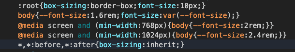

## What I'm currently doing

Currently, this is how I do color theming in <a href="https://github.com/justin-calleja/justincalleja.com" target="_blank">my blog</a> (my WIP and questionably designed blog):

I have a bunch of color functions like:

```js
export const grey100 = (opacity = 1) => `rgba(245, 245, 245, ${opacity})`
// ...
export const red100 = (opacity = 1) => `rgba(255, 205, 210, ${opacity})`
// ...
```

Then, I have the functions I'll actually use when styling my components:

```js
export const getColor = ({ theme, opacity }) =>
  theme.name === themeNames.dark ? `${grey100(opacity)}` : `${grey900(opacity)}`

export const getSecondaryColor = ({ theme, opacity }) =>
  theme.name === themeNames.dark ? `${grey300(opacity)}` : `${grey700(opacity)}`

export const getHighlightColor = ({ theme, opacity }) =>
  theme.name === themeNames.dark ? `${red700(opacity)}` : `${red300(opacity)}`
//...
```

These functions can be used like so when styling components with [styled-components](https://styled-components.com/)

```jsx
const Sidebar = styled.div`
  background-color: ${({ theme }) =>
    getSecondaryBackgroundColor({ theme, opacity: 0.8 })};
  color: ${getColor};
`
```

This is possible because the `theme` prop gets passed to these functions by `styled-components` as I'm wrapping the whole app with their `ThemeProvider`:

```jsx
import { ThemeProvider as StyledThemeProvider } from "styled-components"

export const ThemeProvider = ({ children, themeName }) => {
  const [name, setName] = useLocalStorage("themeName", themeName)
  const toggleThemeName = () =>
    setName(name === themeNames.dark ? themeNames.light : themeNames.dark)
  // use StyledThemeProvider so that all styled components get theme
  // auto injected in their props.
  return (
    <StyledThemeProvider
      theme={{
        name,
        toggleThemeName,
      }}
    >
      {children}
    </StyledThemeProvider>
  )
}
```

Having wrapped the whole app with the `ThemeProvider` above, I'm able to access `theme.name` in the aforementioned functions when used in components styled with `styled-components` (or `withTheme` for components which aren't styled with `styled-components`).

## Problems with this approach

Even as I was using that approach, I knew it wasn't ideal. The thing is, I had plenty of things to do to get to a state where it was half decent to release the blog (and start blogging again - which is what I actually wanted). So, knowing no better way, I just lived with the following:

1. Every time the theme name changes, it would cause a re-render of the styles for every component using theming. Here's a list of only some of them at present:
   - Sidebar
   - SunAndMoon
   - ThemeToggleButton
   - Toc
   - etc…
2. It's limited to only 2 color themes and adding more will require touching every one of the color getting functions based on theme.

Problem `1` is the real issue to me. I haven't seen any issues with the site's performance on my machine but it is a relatively small site. It just doesn't feel right that so many changes have to be made to the DOM every time the theme name changes.

## A better way

Anyway, I didn't revisit the issue until I read <a href="https://www.joshwcomeau.com/" target="_blank">Josh Comeau</a>'s awesome blog post: <a href="https://www.joshwcomeau.com/css/css-variables-for-react-devs/" target="_blank">CSS Variables for React Devs</a>. I had a feeling CSS variables would be "an alternative at least" - but I just didn't have time to explore - now I do.

So lets go off on a bit of a tangent and summarise a section of Josh's post:

<InfoBox style={{ textAlign: "center" }}>
  We have a button whose height we want to change based on viewport size.
</InfoBox>

He proceeds to demo how someone might approach this without using CSS variables; taking a declarative approach:

```jsx
const Button = styled.button`
  height: ${(props) => props.theme.mobileTapHeight}px;
  @media (min-width: ${(props) => props.theme.bp.desktop}) {
    height: ${(props) => props.theme.desktopTapHeight}px;
  }
`
```

This happens to be exactly the sort of thing I'm doing in my blog. E.g.

```jsx
const Sidebar = styled.div`
  /* ... */

  width: ${mobile.width}px;

  ${atLaptopMinWidthOrMore(`
    width: ${desktop.small.width}px;
  `)}

  ${atDesktopMinWidthOrMore(`
    width: ${desktop.large.width}px;
  `)}
`
```

The media query helper functions are just wrapping the styles they're given with the appropriate media queries so I don't have to remember the breakpoint values and get "one source of truth" - but it's the same thing.

<blockquote>
  <p>
    It turns out, CSS variables offer a very compelling solution to this
    problem, but it requires a mental model shift.
  </p>
  <p>
    Instead of imperatively specifying how each component should respond at
    different breakpoints, what if we passed it a <em>reactive variable</em>{" "}
    that tracked that for us?
  </p>
  <footer>
    <cite>
      <a href="https://www.joshwcomeau.com/css/css-variables-for-react-devs/#changing-values-not-variables">
        Josh Comeau
      </a>
    </cite>
  </footer>
</blockquote>

And he proceeds to demo this with the following example:

```jsx
const GlobalStyles = createGlobalStyle`
  html {
    --min-tap-target-height: 48px;
    @media (min-width: ${(props) => props.theme.bp.desktop}) {
      --min-tap-target-height: 32px;
    }
  }
`
```

```jsx
const Button = styled.button`
  height: var(--min-tap-target-height);
`
```

<blockquote>
  <p>
    Inside our components, height always points to the same variable, regardless
    of viewport size. The difference is that <em>the variable</em> changes its
    value when the window width changes.
  </p>
  <footer>
    <cite>
      <a href="https://www.joshwcomeau.com/css/css-variables-for-react-devs/#changing-values-not-variables">
        Josh Comeau
      </a>
    </cite>
  </footer>
</blockquote>

Great! No more specifying what happens at each breakpoint. If you want to opt into that, just use a variable - kinda obvious when somebody spells it out.

## An example

In this section, I'd like to tackle:

- Font size changes at different viewports
- `Sidebar` resizing at different viewports
- theme color changes based on changes in React state

… all using the approach outlined in Josh's post i.e. I should be able to just use a CSS variable to say what the color / width / font size is and they should change automatically based off of React state; viewport size; and theme configuration. Any changes to the DOM should only happen in one place, the definition (or re-definition) of the CSS variables. To do so, I'll be creating a simple sandbox working environment; the repo for which is: <a href="https://github.com/justin-calleja/css-vars-for-react-devs" target="_blank">css-vars-for-react-devs</a>

### Setup

```sh
npx create-snowpack-app css-vars-for-react-devs --template @snowpack/app-template-react
```

That creates a new <a href="https://www.snowpack.dev/" target="_blank">Snowpack</a> project based on a React template. There is no particular reason for using Snowpack here (other than it being the new hotness 🤔 coolness?). It allows for bundleless development:

<blockquote>
  <p>
    Snowpack serves your application unbundled during development. Each file
    needs to be built only once and then is cached forever. When a file changes,
    Snowpack rebuilds that single file. There’s no time wasted re-bundling every
    change
  </p>
  <footer>
    <cite>
      <a href="https://www.snowpack.dev/concepts/how-snowpack-works">
        How Snowpack Works
      </a>
    </cite>
  </footer>
</blockquote>

But, to be completely honest, I've had some issues using it with other tech - probably due to ESM not being used everywhere. Anyway, it won't be a problem here.

Great - now I get to do the "delete extra stuff" dance which comes with most templates. Delete:

- src/App.css 🕺
- src/App.test.jsx 🕺
- src/index.css 🕺
- src/logo.svg 🕺
- Everything other than returning a `null` in src/App.jsx 🕺
- The `index.css` import in src/index.jsx 🕺

and:

```sh
npm i styled-components
```

I'll change App.jsx to:

```js
import React from "react"
import styled, { ThemeProvider } from "styled-components"

const Tmp = styled.div`
  color: ${({ theme }) => theme.color};
`

function App() {
  return (
    <ThemeProvider theme={{ color: "red" }}>
      <Tmp>It works!</Tmp>
    </ThemeProvider>
  )
}

export default App
```

… just to confirm it's working and I get the red text when I `npm start`.

### font-size changes at different viewports

Next, I'll get started on the `theme` object which will soon be passed in place of the current `{ color: 'red' }` being used.

In `src/theme.js` (or `.ts` - snowpack supports it):

```js
const grey100 = (opacity = 1) => `rgba(245, 245, 245, ${opacity})`
const grey200 = (opacity = 1) => `rgba(238, 238, 238, ${opacity})`
const grey800 = (opacity = 1) => `rgba(66, 66, 66, ${opacity})`
const grey900 = (opacity = 1) => `rgba(33, 33, 33, ${opacity})`

const theme = {
  colors: {
    text: grey900(),
    background: grey100(),
    secondaryBackground: grey200(),
    modes: {
      dark: {
        text: grey100(),
        background: grey900(),
        secondaryBackground: grey800(),
      },
    },
  },
  fontSizes: ["1.6rem", "2rem", "2.4rem"],
  breakpoints: ["768px", "1024px"],
}

export default theme
```

I'm trying to base `theme` off of the <a href="https://styled-system.com/theme-specification" target="_blank">styled-system</a> / <a href="https://theme-ui.com/theme-spec" target="_blank">theme-ui</a> theme spec (best I can anyway). Why figure out what to name things when someone else has already done that for you? (it's one of the hardest problems after all). So e.g. it's `theme.colors` not `color`.

Now, from what little I know about `styled-system` and ilk, if you have something like the following `breakpoints` in your `theme`:

```js
  breakpoints: [
    '40em', '56em', '64em',
  ],
```

… you can use arrays to specify what value a CSS property should take at which breakpoint:

```jsx
<Box width={[1, 1 / 2, 1 / 4]} />
```

<blockquote>
  <p>
    Using Styled System with a CSS-in-JS library will generate something like
    the following CSS:
  </p>
  <footer>
    <cite>
      <a href="https://styled-system.com/responsive-styles">
        styled-system responsive styles
      </a>
    </cite>
  </footer>
</blockquote>

```css
.Box-hash {
  width: 100%;
}

@media screen and (min-width: 40em) {
  .Box-hash {
    width: 50%;
  }
}

@media screen and (min-width: 52em) {
  .Box-hash {
    width: 25%;
  }
}
```

In my case:

```js
fontSizes: ['1.6rem', '2rem', '2.4rem'],
breakpoints: ['768px', '1024px'],
```

… in `theme.js` I'm saying I want a `font-size` of `1.6rem` at below my first breakpoint of `768px` (mobile first), `2rem` at `768px` or above etc…

But - of course - I'm not using a library to make this happen so I'll write some JS for it (CSS in JS 💪):

```js
// in src/theme.js
export const breakpointsToCssVarsStringFactory = (breakpoints, varName) => {
  return ({ theme, values }) => {
    const mobileVal = values[0]
    let result = ""

    if (mobileVal) result += `--${varName}: ${mobileVal};\n`

    const otherVals = values.slice(1)
    for (let i = 0; i < otherVals.length; i++) {
      const bp = theme.breakpoints[i]
      if (bp) {
        result += `@media screen and (min-width: ${bp}) { --${varName}: ${otherVals[i]}; }\n`
      }
    }

    return result
  }
}
```

This… admittedly, is a little confusing and cumbersome to work with directly. Ultimately, I want the function I use in my styled components to take a `theme` as one of its props `({ theme })`. I don't want to use the `theme` that's in scope in `src/theme.js` when I'm defining `breakpointsToCssVarsStringFactory` because I want to be able to pass a different `theme` to the `ThemeProvider` if I so choose.

In the case of global (on `body` tag) `font-size` changes, I'll add a helper function to make it easier to use:

```js
// in src/theme.js
export const getFontSizesAsCssString = ({ theme, varName = "font-size" }) => {
  return breakpointsToCssVarsStringFactory(
    theme.breakpoints,
    varName,
  )({ theme, values: theme.fontSizes })
}
```

I'll use it in the global styles, along with any other things that usually go there - like the style reset:

```sh
npm i styled-reset
```

`src/GlobalStyles.js`:

```jsx
import { createGlobalStyle } from "styled-components"
import theme, { getFontSizesAsCssString } from "./theme"
import reset from "styled-reset"

const fontSizes = getFontSizesAsCssString({ theme })
console.log(fontSizes)

export default createGlobalStyle`
  ${reset}

  :root {
    box-sizing: border-box;
    font-size: 10px;
    ${getFontSizesAsCssString}
  }

  body {
    font-size: var(--font-size);
  }

  *,
  *:before,
  *:after {
    box-sizing: inherit;
  }
`
```

Make sure to import and pass in the `theme` if you'd like to see the generated string in the console (as I'm doing above) but that can later be removed. Or you could just inspect the injected `style` tag's contents:



Adding some filler text to `App` and resizing the viewport now shows that it's working.

This style was made globally on `body`; so next I'd like to do something similar at the component level.

### Sidebar width changes at different viewports

For instance, I previously mentioned how `Sidebar` was specifying how its `width` should change at different viewports. This seems like the perfect place to use a CSS variable instead.

`src/Sidebar.jsx`

```jsx
import { useState } from "react"
import styled from "styled-components"
import theme, { breakpointsToCssVarsStringFactory } from "./theme"

const widths = ["288px", "176px", "256px"]

const valuesToWidthsCssVarsString = breakpointsToCssVarsStringFactory(
  theme.breakpoints,
  "width",
)
console.log(valuesToWidthsCssVarsString({ theme, values: widths }))

// ${({ theme }) =>
//   breakpointsToCssVarsStringFactory(
//     theme.breakpoints,
//     'width',
//   )({ theme, values: widths })}

const Sidebar = styled.div`
  ${({ theme }) => valuesToWidthsCssVarsString({ theme, values: widths })}

  width: var(--width);
  left: calc(-1 * var(--width));

  background-color: coral;
  position: fixed;
  height: 100%;
  overflow-x: hidden;
  transition: left 0.2s ease-in;
  z-index: 100;

  ${({ isOpen }) => (isOpen ? { left: 0 } : {})};
`

export const useSidebarState = () => {
  const [isOpen, setIsOpen] = useState(false)
  const toggle = () => setIsOpen(!isOpen)

  return [isOpen, toggle]
}

export default Sidebar
```

Again… I'm doing the whole `console.log` thing to see the generated styles in the console but they can be removed and I left a comment with how to inject the styles directly in the component.

I'm basically using `left` to show / hide the sidebar based on `isOpen` React state. Both `width` and `left` are based off of the `--width` CSS var and I inject this breakpoint dependent variable scoped to the component's styles.

Finally, I'm adding a little React hook for users of this component so they have access to its open state and can toggle the Sidebar.

Here's `Sidebar` in action in `App.jsx`:

```jsx
import React from "react"
import { ThemeProvider } from "styled-components"
import theme from "./theme"
import GlobalStyles from "./GlobalStyles"
import Sidebar, { useSidebarState } from "./Sidebar"

function App() {
  const [isSidebarOpen, toggleSidebar] = useSidebarState()

  window.toggleSidebar = toggleSidebar

  return (
    <ThemeProvider theme={theme}>
      <GlobalStyles />
      <Sidebar isOpen={isSidebarOpen} />
      <p>
        Lorem ipsum dolor, sit amet consectetur adipisicing elit. Soluta,
        nesciunt.
      </p>
    </ThemeProvider>
  )
}

export default App
```

Running `toggleSidebar()` in the console and resizing the viewport now shows the expected behaviour.

### color changes based on state

For color theming, again I'm trying to base it off of what's used in <a href="https://styled-system.com/guides/color-modes" target="_blank">styled-system</a>.

In my styled components, I'd like to just use CSS variables like so:

```css
background-color: var(--colors-primary);
color: var(--colors-text);
```

But I want the actual values that these variables take to be dependent on the React state of `colorMode`. Here's the `theme` again:

```js
const theme = {
  colors: {
    text: grey900(),
    background: grey100(),
    secondaryBackground: grey200(),
    modes: {
      dark: {
        text: grey100(),
        background: grey900(),
        secondaryBackground: grey800(),
      },
    },
  },
  fontSizes: ["1.6rem", "2rem", "2.4rem"],
  breakpoints: ["768px", "1024px"],
}
```

When `colorMode` is `'dark'`, `var(--colors-text)` should be `grey100()`. If `colorMode` is an empty string or some value which is not one of the keys of `modes`, then `var(--colors-text)` should be `grey900()` - the top level definition. Similarly for all other color variables:

```jsx
import { css } from "styled-components"

// in src/theme.js
export const getColorsAsCssString = ({ theme, varName = "colors" }) => {
  const { modes, ...colors } = theme.colors

  // https://styled-components.com/docs/api#css
  return css`
    ${(props) => {
      return Object.entries(colors)
        .map(
          ([key, val]) =>
            `--${varName}-${key}: ${
              modes?.[props.theme.colorMode]?.[key] || val
            };`,
        )
        .join("\n")
    }}
  `
}
```

Because this is dependent on the `colorMode` state, I need to use a function in my template literals. I also need to use `styled-component`'s' `css` helper function as I will be using `getColorsAsCssString` in a string template interpolation and `getColorsAsCssString` uses functions:

<blockquote>
  <p>
    You need to use this if you return a template literal with functions inside
    an interpolation due to how tagged template literals work in JavaScript.
  </p>
  <footer>
    <cite>
      <a href="https://styled-components.com/docs/api#css">
        styled-components css
      </a>
    </cite>
  </footer>
</blockquote>

i.e. I'll be adding the color variables to the document root in the global styles like so:

```jsx
import { createGlobalStyle } from "styled-components"
import theme, { getFontSizesAsCssString, getColorsAsCssString } from "./theme"
import reset from "styled-reset"

export default createGlobalStyle`
  ${reset}

  :root {
    box-sizing: border-box;
    font-size: 10px;
    ${getFontSizesAsCssString}
    ${getColorsAsCssString}
  }

  body {
    font-size: var(--font-size);
    background-color: var(--colors-background);
    color: var(--colors-text);
  }

  *,
  *:before,
  *:after {
    box-sizing: inherit;
  }
`
```

Re `getColorsAsCssString`, I'm just trying to set the CSS var to be the "more specific" color mode value before falling back to the default using the <a href="https://developer.mozilla.org/en-US/docs/Web/JavaScript/Reference/Operators/Optional_chaining" target="_blank">optional chaining operator</a>:

```js
  return css`
    ${(props) => {
      return Object.entries(colors)
        .map(
          ([key, val]) =>
            `--${varName}-${key}: ${
              modes?.[props.theme.colorMode]?.[key] || val
            };`,
        )
        .join("\n")
    }}
```

Notice that I'm using `--colors-background` and `--colors-text` on `body` in the global styles so I don't have to repeat this for every component on the page (something I _am_ doing in my current approach to color theming). However, I'd like my `Sidebar` to have a different `background-color`, so I can overwrite it there:

```css
background-color: var(--colors-secondaryBackground);
```

Again, since this is all dependent on the `colorMode` state, I need to create this state and make sure to include it as part of the `theme` so it gets passed down to all components I'm trying to style. To do so, I'll first install `react-use-localstorage` so I can persist the color mode to localstorage:

```sh
npm i react-use-localstorage
```

… and then use it in `App.jsx`, making sure to pass `colorMode` to `theme` (and exposing `setColorMode` globally so I have something to toggle the color mode with):

```jsx
import React from "react"
import { ThemeProvider } from "styled-components"
import useLocalStorage from "react-use-localstorage"
import theme from "./theme"
import GlobalStyles from "./GlobalStyles"
import Sidebar, { useSidebarState } from "./Sidebar"

function App() {
  const [colorMode, setColorMode] = useLocalStorage("colorMode", "")
  const [isSidebarOpen, toggleSidebar] = useSidebarState()

  window.setColorMode = setColorMode
  window.toggleSidebar = toggleSidebar

  return (
    <ThemeProvider
      theme={{
        ...theme,
        colorMode,
      }}
    >
      <GlobalStyles />
      <Sidebar isOpen={isSidebarOpen}>Hello</Sidebar>
      <p>
        Lorem ipsum dolor, sit amet consectetur adipisicing elit. Soluta,
        nesciunt.
      </p>
    </ThemeProvider>
  )
}

export default App
```

With that in place, I can now toggle the color mode with `setColorMode('dark')` in the console and get the desired effect 🎉

---

btw, if you're using `react-use-localstorage` in a server side rendered app, then you'll need to wrap its usage in something like this so that you don't try accessing `localStorage` on the server:

```js
// useSsrLocalStorage.js
import useLocalStorage from "react-use-localstorage"

export default (key, initial) =>
  // NOTE: it's true the hook is called conditionally but for SSR will always take one branch and
  // client side rendering will always be the other:
  // eslint-disable-next-line react-hooks/rules-of-hooks
  typeof window !== "undefined" ? useLocalStorage(key, initial) : [initial]
```
